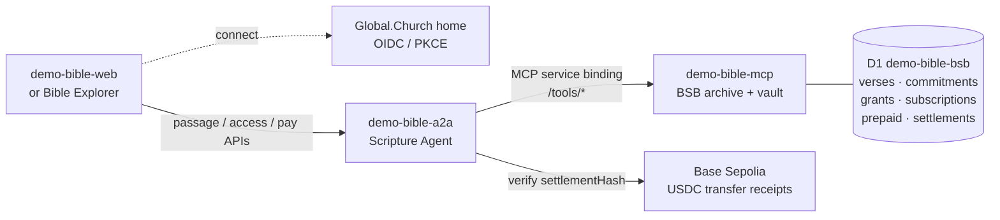
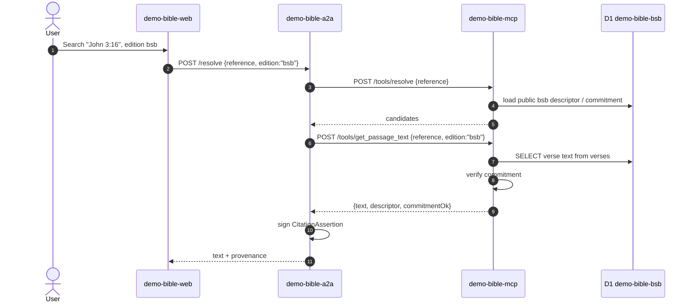

# demo-bible-a2a Architecture

`demo-bible-a2a` is the public Scripture Agent facade. Browser apps call this
Worker, and this Worker calls `demo-bible-mcp` for corpus data, access ledgers,
entitlements, payment records, and final text retrieval.

The key split:

- **A2A owns the public interaction**: id-token verification, payment/x402 UX,
  settlement verification, and orchestration.
- **MCP owns the vault state and final gate**: corpus descriptors, verse text,
  entitlement ledger, subscription/prepaid ledgers, settlement ledger, and
  `get_passage_text` enforcement.

## Services

| Component | Role |
|---|---|
| `demo-bible-web` / Bible Explorer | Browser client. Connects the user, requests passages, handles payment prompts, and renders verse/provenance results. |
| `demo-bible-a2a` | Public Scripture Agent. Verifies connected users, talks to MCP through the `MCP` service binding, and handles x402 payment claim/verification. |
| `demo-bible-mcp` | BSB archive and vault. Holds D1 corpus, access ledgers, payment ledgers, and final text gate. |
| D1 `demo-bible-bsb` | MCP database: BSB verses, commitments, entitlement requests, grants, prepaid passes, subscriptions, settlements. |
| Global.Church homes | OIDC/PKCE identity source. id_token `sub` is the reader canonical agent id. |
| Base Sepolia / mock USDC | x402 settlement proof source. A2A verifies the reader's payment transaction by reading chain receipts. |



## Public Endpoints In A2A

| A2A endpoint | Purpose | MCP calls |
|---|---|---|
| `POST /resolve` | Public verifiable resolve for an edition. | `/tools/resolve`, `/tools/get_passage_text`, `/tools/verify_citation` depending on path. |
| `POST /resolve-licensed` | Connected, presenter-bound gated text read. | `/tools/get_passage_text`. |
| `POST /access-status` | Check whether a connected reader can access an edition. | `/tools/verify_access`, `/tools/get_subscription`, `/tools/subject_treasury`, `/tools/usdc_balance`. |
| `POST /my-entitlements` | Reader pickup of granted entitlement VCs. | `/tools/list_entitlements`. |
| `POST /request-entitlement` | Reader asks corpus owner for manual/free access. | `/tools/request_entitlement`. |
| `POST /pay/claim` | Claim a completed x402 payment and mint access. | `/tools/check_settlement`, `/tools/record_settlement`, `/tools/record_subscription` or `/tools/mint_prepaid`. |
| `POST /pay/subscription` | Read active subscription state. | `/tools/get_subscription`. |
| `POST /pay/subscription/cancel` | Cancel subscription renewal. | `/tools/cancel_subscription`. |
| `POST /pay/subscription/renew` | Verify renewal settlement and advance subscription period. | `/tools/check_settlement`, `/tools/record_settlement`, `/tools/renew_subscription`. |

## Flow 1 — Public BSB Passage

For `edition = "bsb"`, the MCP serves public text from the full BSB D1 corpus.
No entitlement, subscription, prepaid pass, or x402 payment is needed.



## Flow 2 — Licensed BSB Read With Existing Access

For `edition = "lbsb"`, A2A verifies the reader's id token and passes the
reader subject to MCP. MCP decides the access lane in this order:

1. owner-issued grant entitlement
2. active subscription
3. active prepaid x402 pass
4. otherwise no access, return payment required

```mermaid
sequenceDiagram
  autonumber
  actor U as Reader
  participant Web as demo-bible-web
  participant Home as Global.Church home
  participant A2A as demo-bible-a2a
  participant MCP as demo-bible-mcp
  participant DB as D1 demo-bible-bsb

  U->>Web: Connect
  Web->>Home: OIDC / PKCE
  Home-->>Web: id_token
  U->>Web: Read "John 3:16", edition lbsb
  Web->>A2A: POST /my-entitlements {id_token}
  A2A->>A2A: verify id_token via home JWKS
  A2A->>MCP: POST /tools/list_entitlements {subject}
  MCP->>DB: SELECT granted entitlement VCs for subject
  MCP-->>A2A: entitlements
  A2A-->>Web: entitlements
  Web->>A2A: POST /resolve-licensed {id_token, reference, edition:"lbsb", entitlement?}
  A2A->>A2A: verify id_token; derive subject
  A2A->>MCP: POST /tools/get_passage_text {reference, edition:"lbsb", subject, entitlement?}
  MCP->>DB: check grant / subscription / prepaid ledgers
  MCP->>DB: SELECT BSB text when access lane allows
  MCP-->>A2A: {text, accessVia, commitmentOk}
  A2A-->>Web: licensed text result
```

## Flow 3 — Licensed BSB Read Without Access, x402 Required

When the reader has no grant, no active subscription, and no prepaid pass, MCP
returns `402`. A2A is the public payment surface: it returns the payment
challenge to the browser, then later verifies the settlement and records the
result in MCP.

```mermaid
sequenceDiagram
  autonumber
  actor U as Reader
  participant Web as demo-bible-web
  participant Home as Global.Church home
  participant A2A as demo-bible-a2a
  participant MCP as demo-bible-mcp
  participant Chain as Base Sepolia
  participant DB as D1 demo-bible-bsb

  U->>Web: Read gated lbsb passage
  Web->>A2A: POST /resolve-licensed {id_token, reference, edition:"lbsb"}
  A2A->>A2A: verify id_token; derive subject
  A2A->>MCP: POST /tools/get_passage_text {reference, edition:"lbsb", subject}
  MCP->>DB: no grant, no active subscription, no prepaid pass
  MCP-->>A2A: 402 {error:"payment required", gated:"lbsb"}
  A2A-->>Web: 402 + x402 payment requirement
  Web->>Home: user confirms payment / signs settlement
  Home->>Chain: reader treasury pays lbsb treasury
  Chain-->>Home: settlementHash
  Home-->>Web: settlementHash
  Web->>A2A: POST /pay/claim {id_token, edition:"lbsb", settlementHash, tierId}
  A2A->>A2A: verify id_token; derive subject
  A2A->>Chain: verify USDC transfer receipt to lbsb treasury
  Chain-->>A2A: valid transfer amount
  A2A->>MCP: POST /tools/check_settlement {settlementHash}
  MCP-->>A2A: not seen
  A2A->>MCP: POST /tools/record_settlement {edition, payer, payee, asset, amount, settlementHash}
  MCP->>DB: INSERT payments_settled
  alt subscription tier
    A2A->>MCP: POST /tools/record_subscription {edition, subject, tier, pullMandate?}
    MCP->>DB: INSERT / update subscriptions
  else prepaid / PAYG tier
    A2A->>MCP: POST /tools/mint_prepaid {edition, subject, maxUses, validUntil}
    MCP->>DB: INSERT prepaid_entitlements
  end
  A2A-->>Web: payment claimed; access balance updated
  Web->>A2A: retry POST /resolve-licensed
  A2A->>MCP: POST /tools/get_passage_text {reference, edition:"lbsb", subject}
  MCP->>DB: consume subscription/prepaid access lane
  MCP-->>A2A: licensed verse text
  A2A-->>Web: licensed text result
```

## Flow 4 — Access Status / UI Meter

Before showing a pay button, the browser asks A2A for the current access state.
A2A assembles this view from multiple MCP tools.

```mermaid
sequenceDiagram
  autonumber
  participant Web as demo-bible-web
  participant A2A as demo-bible-a2a
  participant MCP as demo-bible-mcp
  participant DB as D1 demo-bible-bsb

  Web->>A2A: POST /access-status {id_token, edition:"lbsb"}
  A2A->>A2A: verify id_token; derive subject
  A2A->>MCP: POST /tools/verify_access {edition, subject}
  MCP->>DB: check grant, subscription, prepaid
  MCP-->>A2A: {allowed, via, remaining}
  A2A->>MCP: POST /tools/get_subscription {edition, subject}
  MCP-->>A2A: active subscription, if any
  A2A->>MCP: POST /tools/subject_treasury {edition, subject}
  MCP-->>A2A: reader treasury address, if known
  A2A->>MCP: POST /tools/usdc_balance {address}
  MCP-->>A2A: treasury mock-USDC balance
  A2A-->>Web: access meter / subscription / treasury status
```

## Notes

- x402 is **client ↔ A2A** as the public protocol surface. MCP is not the
  browser-facing payment negotiator.
- MCP still performs the final `get_passage_text` gate, so a client cannot
  bypass payment state by calling a different A2A endpoint.
- `lbsb` currently reuses BSB text, but applies a licensed edition policy.
- Grants are free/comp overrides. For normal `lbsb` access, subscription,
  prepaid x402, or pay-per-use x402 are the intended lanes.
