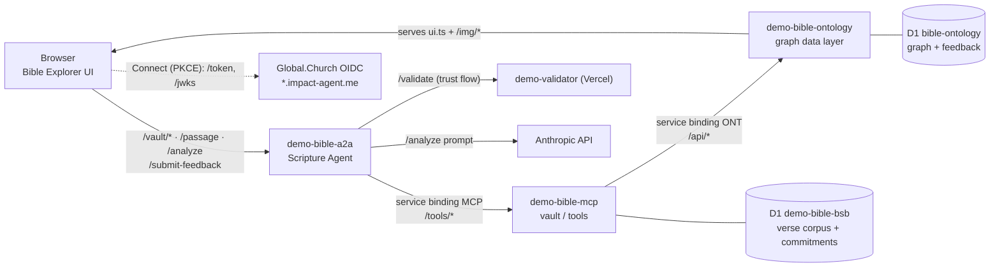
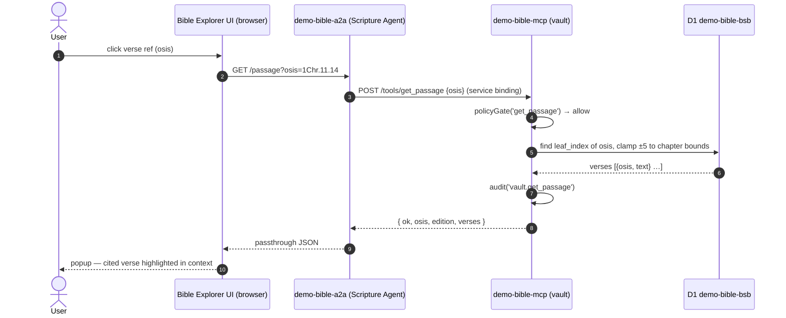
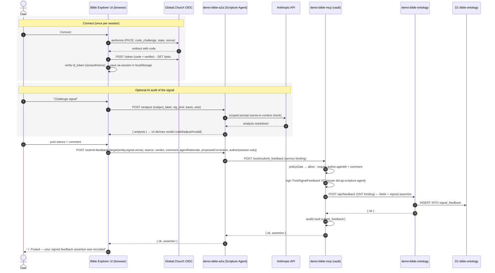

# Architecture — Bible Explorer (demo-bible-ontology)

How the Bible Explorer UI, the Scripture Agent (A2A), the MCP vault, and the
ontology data layer fit together — and the exact interaction flows for
**reading verse text** and **posting user feedback** on a trust signal.

## Applications & services

| Service | Where | Role | Storage |
|---|---|---|---|
| **Bible Explorer UI** (`src/ui.ts`) | Browser SPA, served by this Worker | Explore the knowledge graph, read verses, challenge trust signals, post feedback | `localStorage`: `sa.session` (connect session), `ont.imgMode` (image pref) · `sessionStorage`: `sa.pending` (PKCE state) |
| **demo-bible-ontology** (this Worker) | Cloudflare Worker, port 8795 | **Graph data layer only.** Serves the UI + static images, and `/api/*` (entities, edges, signals, scores, map, lineage, feedback thread) | D1 `bible-ontology` (node, edge, node_verse, signal, score, signal_feedback, …) |
| **demo-bible-a2a** — "Scripture Agent" | Cloudflare Worker, port 8791 | Public **agent surface** (A2A agent card + skills). The only endpoint the browser talks to for data: `/vault/*`, `/passage`, `/analyze`, `/submit-feedback`, `/resolve`, `/verify` | none (stateless; in-memory transparency log) |
| **demo-bible-mcp** — vault | Cloudflare Worker, port 8790 | MCP **tools** behind the agent: `get_passage`, `graph_query`, `submit_feedback`, `resolve`, `get_passage_text`, `get_entity`, `get_trust_signals`, … Signs credentials, gates by policy, audits | D1 `demo-bible-bsb` (full BSB verse corpus + Merkle leaf commitments + corpusRoot) |
| **demo-validator** | Vercel | Independent validator for evidence bundles (`/trust/validate` flow) | — |
| **Anthropic API** | external | LLM behind `/analyze` (Signal-Court trust audit) | — |
| **Global.Church identity** (`*.impact-agent.me`) | external | OIDC + PKCE "Connect" sign-in; JWKS-verified id_token. Required before posting feedback | — |

### Wiring

- Browser → **A2A only** for all data. The UI never calls the MCP or the
  ontology `/api` cross-origin; even this Worker's graph reads are fetched via
  `A2A_BASE + '/vault' + path`.
- A2A → MCP via a **service binding** (`MCP`, avoids CF error 1042); local dev
  falls back to `MCP_URL`.
- MCP → ontology via a **service binding** (`ONT`) — `graph_query` forwards
  allowlisted `/api/*` GET paths, `submit_feedback` POSTs to `/api/feedback`.
- Verse **text** lives only in the MCP's D1 corpus (single source of truth);
  this Worker stores verse *links* (`node_verse.osis`), never passage text.

## Flow 1 — Getting verse data

User clicks a verse reference chip (e.g. `1Chr.11.14`) on an entity page →
`openPassage(osis)` opens the popup and fetches a chapter-clamped window of
verses around the citation.

Notes:
- Graph reads (which entities cite which verses) follow the same path through
  the agent: `UI → A2A GET /vault/node/David → MCP /tools/graph_query
  {path:'/api/node/David'} → ONT binding → this Worker's D1`.
- The separate *verifiable* path (`/resolve`) adds entitlement gating, Merkle
  commitment verification, and a signed `CitationAssertion`; `/passage` is the
  lightweight read-in-context path used by this UI.

## Flow 2 — Posting feedback on a trust signal

From the **Signal Court** modal: the user must be *connected* (Global.Church
OIDC + PKCE), can optionally run the AI audit (`/analyze`), then posts a
stance (agree / challenge / note). The MCP mints a **signed
`TrustSignalFeedback` verifiable credential** and persists it into this
Worker's public feedback thread.

The feedback thread is read back through the same agent path:
`UI → A2A /vault/feedback?subject=…&basis=… → MCP graph_query →
GET /api/feedback` (rows flagged `signed` when an assertion is attached).
