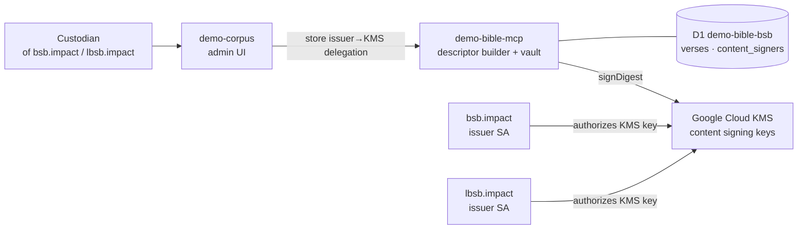
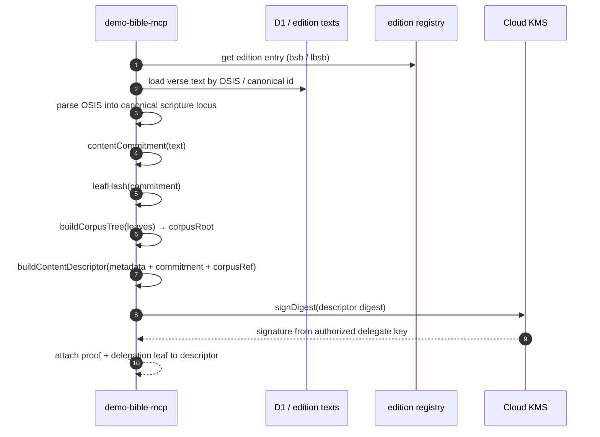
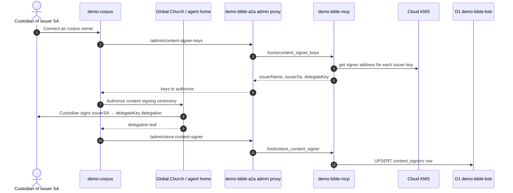
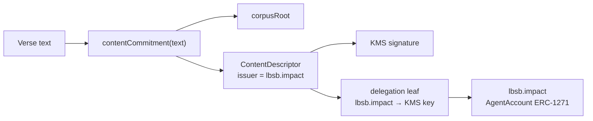

# demo-corpus Architecture

`demo-corpus` is the corpus owner/admin surface. It does not build verse
descriptors itself. It lets the owner claim a corpus, approve/revoke access,
and run the one-time ceremony that authorizes each issuer's Cloud-KMS key to
sign descriptors and entitlement credentials.

This document focuses on descriptor creation and signing: how verse descriptors
are built, how signatures happen, and where the custodians of `bsb.impact` and
`lbsb.impact` enter the flow.

## Key Idea

The content service (`demo-bible-mcp`) builds descriptors. The issuer's
authorized signer signs descriptor digests.

For delegated production mode:

```text
bsb edition  → issuer bsb.impact  → Cloud KMS key authorized by bsb.impact
lbsb edition → issuer lbsb.impact → Cloud KMS key authorized by lbsb.impact
```

The KMS key is not the owner. It is a delegated operational signer. The real
authority is the issuer Smart Agent (`bsb.impact` or `lbsb.impact`) and its
custodian, who authorizes that KMS key through the demo-corpus ceremony.

## Components

| Component | Role |
|---|---|
| `demo-corpus` | Owner/admin UI. Runs claim and "Authorize content signing" ceremonies. |
| `demo-bible-mcp` | Builds descriptors, Merkle roots, commitments, entitlements, and final access gates. |
| `bsb.impact` | Smart Agent issuer for public BSB descriptors. |
| `lbsb.impact` | Smart Agent issuer for Licensed BSB descriptors. |
| Custodian of `bsb.impact` / `lbsb.impact` | Human/agent authorized by agent-naming / AgentAccount custody. Signs the issuer-to-KMS delegation. |
| Google Cloud KMS | Holds the operational secp256k1 signing key. Private key never leaves KMS. |
| D1 `demo-bible-bsb` | Stores BSB verses, entitlement ledgers, and `content_signers` authorization rows. |



## Edition To Issuer Mapping

Defined in `apps/demo-bible-mcp/src/editions/registry.ts`:

| Edition | Access | Issuer name |
|---|---|---|
| `bsb` | public | `bsb.impact` |
| `lbsb` | licensed | `lbsb.impact` |
| `demo-licensed` | licensed mock | `demo-licensed.impact` |

The important production pair is:

```text
bsb  → bsb.impact
lbsb → lbsb.impact
```

That means `lbsb` descriptors should not be signed under `bsb.impact`. They are
attributed to `lbsb.impact` and use the content signer authorized by the
custodian of `lbsb.impact`.

## Descriptor Build Flow

MCP builds descriptors when it builds or resolves a corpus.

For embedded editions like `lbsb`, descriptor creation happens in
`apps/demo-bible-mcp/src/editions/registry.ts`.

For D1-backed public BSB lookups, descriptors are built on demand in
`apps/demo-bible-mcp/src/editions/d1.ts`.

The build sequence is:



The descriptor contains:

```text
canonicalId       = stable scripture locus, e.g. John 3:16
issuer            = bsb.impact or lbsb.impact Smart Agent address
work.edition      = bsb or lbsb
accessPolicy      = public or licensed
commitment        = hash of the verse text
corpusRef         = hash-like reference to issuer + edition + version
retrievalPointer  = where the text can be requested
proof/signature   = descriptor digest signed by the authorized signer
delegation leaf   = issuer Smart Agent authorized the KMS signer
```

## How The Signature Happens

`TRUST_MODE=delegated` is the intended production mode.

In that mode, `demo-bible-mcp/src/lib/trust-context.ts` does this for every
distinct issuer name in the edition registry:

1. Resolve the issuer name through agent-naming:

   ```text
   bsb.impact  → issuer Smart Agent address
   lbsb.impact → issuer Smart Agent address
   ```

2. Load the matching Cloud KMS key from `CONTENT_SIGNER_KEYS`.

3. Derive the KMS key's Ethereum-style address.

4. Load the stored authorization from D1:

   ```text
   content_signers[issuer_name]
     issuer_sa
     delegate_key
     delegation_leaf
   ```

5. Confirm the stored `delegate_key` matches the actual KMS key address.

6. Return a per-edition signer:

   ```text
   signerForEdition(bsb)  → issuer=bsb.impact SA,  signDigest=bsb KMS key
   signerForEdition(lbsb) → issuer=lbsb.impact SA, signDigest=lbsb KMS key
   ```

7. When `buildContentDescriptor(...)` asks for a signature, MCP calls:

   ```text
   KMS.signDigest(descriptorDigest)
   ```

8. The descriptor carries both:

   ```text
   signature by KMS delegate key
   delegation leaf: issuer SA → KMS delegate key
   ```

So the descriptor is operationally signed by KMS, but trusted as an act of the
issuer because the issuer Smart Agent authorized that KMS key.

## Content Signer Authorization Ceremony

This is where the custodian plays a role.

The custodian does not sign every descriptor. Instead, the custodian signs once
to authorize the KMS key for the issuer.

Before this ceremony can run, the KMS keys must already exist. That is what the
repo-level provisioning script does.

### Provisioning The KMS Content-Signer Keys

Run from the repo root:

```bash
cd /home/barb/verifiable-content-demo
GCP_SERVICE_ACCOUNT_JSON="$(cat /path/to/your-sa.json)" \
KMS_LOCATION=us-central1 KMS_KEYRING=content-signers \
node scripts/provision-content-signer-keys.mjs
```

This script is needed because delegated mode requires one HSM-backed signing key
per signing identity:

```text
bsb.impact          → Cloud KMS secp256k1 key
lbsb.impact         → Cloud KMS secp256k1 key
demo-validator.impact → Cloud KMS secp256k1 key
```

The script **does not** create `bsb.impact` or `lbsb.impact`. Those Smart Agents
exist in agent-naming / Global.Church identity. The script only creates the
operational delegate keys that those Smart Agents will later authorize.

It consumes:

| Input | Meaning |
|---|---|
| `GCP_SERVICE_ACCOUNT_JSON` | Google service account JSON with `client_email`, `private_key`, and `project_id`; used to call Google KMS admin APIs. |
| `KMS_LOCATION` | KMS region, default `us-central1`. |
| `KMS_KEYRING` | Key ring name, default `content-signers`. |
| CLI args | Optional issuer names. If omitted, defaults to `bsb.impact`, `lbsb.impact`, `demo-validator.impact`. |

For each issuer name, it creates or reuses:

```text
projects/<project>/locations/<location>/keyRings/<keyring>/cryptoKeys/<issuer-name>/cryptoKeyVersions/1
```

Each key is:

```text
purpose: ASYMMETRIC_SIGN
algorithm: EC_SIGN_SECP256K1_SHA256
protectionLevel: HSM
```

The private key never leaves Google KMS. Later, MCP's `GcpKmsSigner` asks KMS to
sign a descriptor digest and receives back a signature.

The script outputs a JSON map like:

```json
{
  "bsb.impact": "projects/.../cryptoKeys/bsb-impact/cryptoKeyVersions/1",
  "lbsb.impact": "projects/.../cryptoKeys/lbsb-impact/cryptoKeyVersions/1",
  "demo-validator.impact": "projects/.../cryptoKeys/demo-validator-impact/cryptoKeyVersions/1"
}
```

That output becomes the MCP secret:

```bash
cd apps/demo-bible-mcp
echo '<json-map>' | npx wrangler secret put CONTENT_SIGNER_KEYS --env production
npx wrangler secret put GCP_SERVICE_ACCOUNT_JSON --env production
```

It also grants the runtime service account `roles/cloudkms.signerVerifier` on the
key ring, so the deployed MCP can call `getPublicKey` and `asymmetricSign`.

What the script does **not** do:

- It does not write `content_signers`.
- It does not authorize the keys.
- It does not prove `bsb.impact → KMS key`.
- It does not build or sign descriptors.

Those happen in the next step: the demo-corpus "Authorize content signing"
ceremony.



After this ceremony, MCP can build descriptors for that issuer in delegated
mode. If the `lbsb.impact` custodian has not authorized its key, `lbsb` is
unavailable in delegated mode instead of silently falling back to the wrong
issuer.

## Verification Flow

When a client resolves a verse, MCP returns candidate descriptors. Verification
checks:

1. The descriptor's content commitment is included in the edition corpus root.
2. The descriptor is signed by the delegate key.
3. The descriptor carries an authorization leaf.
4. The authorization leaf proves:

   ```text
   issuer Smart Agent → delegate KMS key
   ```

5. The issuer Smart Agent signature is checked through ERC-1271 / AgentAccount.



## What demo-corpus Owns vs What MCP Owns

`demo-corpus`:

- verifies the connected owner
- scopes admin actions by selected corpus (`bsb` or `lbsb`)
- starts the "Authorize content signing" ceremony
- stores the returned authorization leaf through A2A/MCP
- approves/revokes grants and views payment/subscription ledgers

`demo-bible-mcp`:

- resolves issuer names
- derives KMS signer addresses
- loads `content_signers`
- builds commitments, Merkle roots, and descriptors
- signs descriptor digests via KMS
- verifies descriptor signatures and delegation authority
- enforces final access to verse text

## Current Mode Summary

| Mode | Descriptor issuer | Who signs digest | Notes |
|---|---|---|---|
| `dev` | fixed dev EOA | fixed dev EOA | local/demo fallback only |
| `onchain` | one `ISSUER_NAME` for the whole worker | `ISSUER_OWNER_PK` | not per-edition; useful but not enough for `bsb` + `lbsb` split |
| `delegated` | per-edition issuer (`bsb.impact`, `lbsb.impact`) | per-issuer Cloud KMS key | intended production architecture |

## Plain English

MCP makes the descriptor.

KMS signs the descriptor digest.

The custodian of `lbsb.impact` does not sign every descriptor. The custodian
signs once to say:

```text
lbsb.impact authorizes this KMS key to sign content descriptors for lbsb
```

Then every `lbsb` descriptor can be verified back to `lbsb.impact`, even though
the day-to-day signature came from the KMS key.
