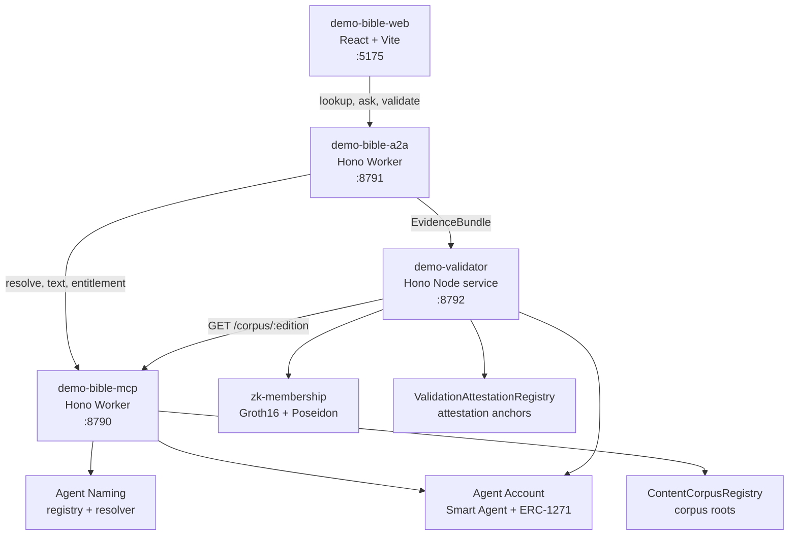

# Documentation

This folder explains the `verifiable-content-demo` architecture, trust model,
agent-to-agent flows, entitlement lifecycle, and payment plans.

## Core Architecture

- [Branding Approach](./branding-approach.md) - value narrative, differentiation from YouVersion-style products, and stakeholder messaging.
- [Agentic Trust Technical Description](./agentic-trust-technical-description.md) - simple technical explanation of validators, translation agents, and shared response evidence.
- [Initialization and Data Sources](./initialization-and-data-sources.md) - how verse data, edition registries, corpora, contract registries, and validator data sources are initialized.
- [Information Architecture](./information-architecture.md) - user-facing concepts, labels, content objects, and navigation model.
- [Operational Architecture](./operational-architecture.md) - local services, ports, scripts, runtime dependencies, checks, and observability.
- [System Architecture](./system-architecture.md) - component boundaries, trust boundaries, data flow, and entitlement flow.
- [Technical Architecture](./technical-architecture.md) - implementation details, package layout, APIs, domain types, and extension points.
- [Corpus Ownership and Entitlements](./corpus-ownership-and-entitlements.md) - corpus-owner onboarding, KMS/delegation trust chain, request/grant/deliver entitlement flow, and security audit.
- [Social Connect Hardening](./social-connect-hardening.md) - future production hardening for OAuth/OIDC token custody, KMS envelope encryption, recovery wrapping, and Smart Account custody.
- [Impact Apps Setup](./impact-apps-setup.md) - from-blank-repo guide to create + configure the three Impact apps (impact, impact-a2a, impact-mcp) on `@agenticprimitives/*`: workspace/overrides, Cloudflare KV/D1, GCP KMS signer/envelope/vault keys, secrets, deploy, and Vercel env.
- [OpenBook](./openbook.md) - product/architecture draft mapping the OpenBook PRD to this repo's Bible Web, corpus admin, A2A, MCP, validator, and ontology/explorer stack.

## A2A, Entitlements, And Payments

- [A2A Platform Requirements](./a2a-platform-requirements.md) - async, delegation-authorized agent-to-agent task transport requirements.
- [Corpus Entitlements Consumer Spec](./corpus-entitlements-consumer-spec.md) - repo implementation contract for corpus ownership, request/grant/deliver entitlements, and gated reads.
- [x402 Licensed Scripture Payments](./x402-licensed-scripture-payments.md) - platform requirements for per-use x402 payment rails for licensed scripture.
- [x402 Licensed Scripture Consumer Spec](./x402-licensed-scripture-consumer-spec.md) - repo implementation contract for x402-gated licensed scripture access.

The demo is a multi-package workspace:

Core principle: verse text stays in the app's off-platform store; verifiability comes from canonical scripture loci, issuer-signed content descriptors, commitments, Merkle inclusion, optional Groth16 zk membership, entitlement policy, signed citations, signed validation attestations, trust graph edges, and independent validator checks.

The working demo covers these flows:

- Lookup: web -> A2A -> MCP -> signed `CitationAssertion`.
- Ask: web -> A2A topic answer -> multiple signed citations -> in-memory transparency log.
- Entitlement: reader request -> owner approval in `demo-corpus` -> MCP signed entitlement -> vault pickup via A2A -> gated content read.
- Validation: A2A assembles `EvidenceBundle` -> hosted validator -> `ValidationAttestation` + trust graph + optional on-chain attestation anchor.
- ZKP: `validate:e2e` builds a Groth16 membership proof locally and the hosted validator verifies it.
- On-chain trust: MCP verifies issuer Smart Agent signatures through ERC-1271 and reads corpus roots from `ContentCorpusRegistry`.
