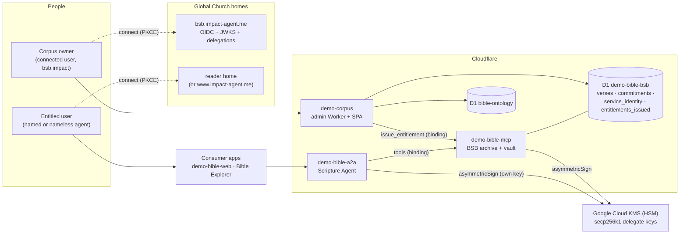
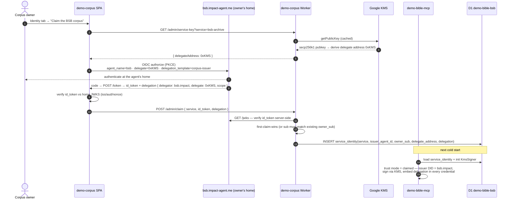
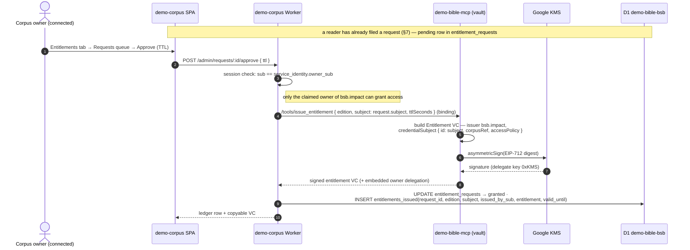
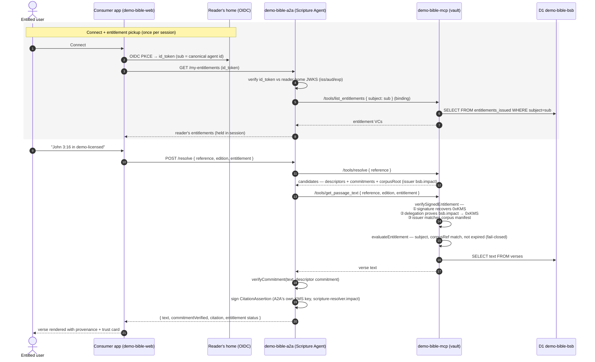
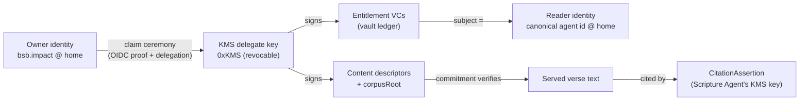
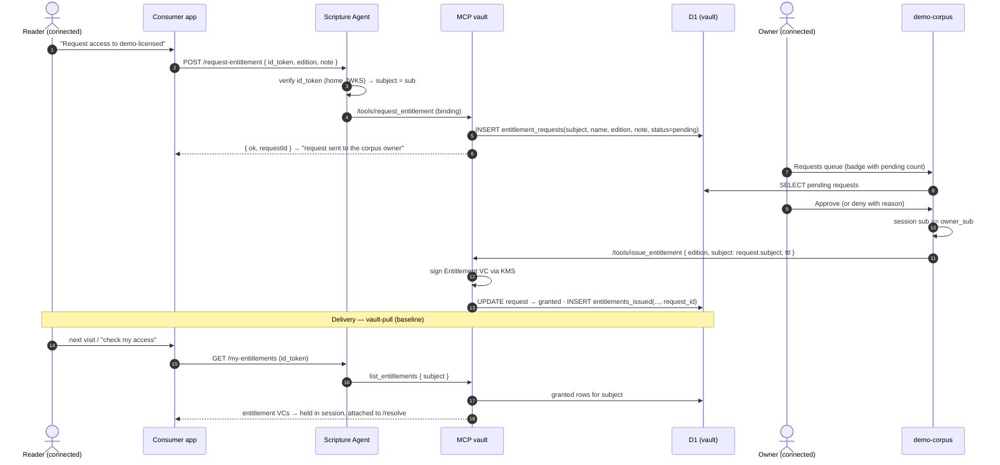

# Corpus Ownership, Entitlements & Entitled Access — Target Architecture

> **Status: design (to-be).** Companion to the demo-corpus plan. Describes how a
> connected user becomes the owner of the BSB corpus (no generated EOA controls
> `bsb.impact`), how entitlements are issued and held in the BSB vault, and how
> an entitled user's access request reaches the verse data.

## 1. The pieces

| Piece | Kind | Identity / keys | Role |
|---|---|---|---|
| **Connected user (corpus owner)** | Human + their Global.Church home at `bsb.impact-agent.me` | Owns the named smart agent `bsb.impact`; their home custodies its keys and mints delegations at sign-in. **No key in this repo controls it.** | Claims the corpus; authorizes the service delegate key; grants entitlements |
| **Entitled user (reader)** | Human/agent, named or nameless | Canonical agent id from their home's id_token (`{name}.impact-agent.me` or central `www.impact-agent.me`) | Receives an entitlement; reads gated verse text |
| **demo-corpus** (new) | CF Worker + inline SPA (port 8796) | None of its own — verifies id_tokens via the issuer home's JWKS | Admin surface: corpus/ontology/signal curation, **claim ceremony**, entitlement issuance, vault ledger |
| **demo-bible-mcp** — "BSB archive + vault" | CF Worker (8790) | Issuer DID = the **claimed agent** (`bsb.impact`); signs via **Google Cloud KMS** delegate key; authority = owner's delegation | Verse corpus, content descriptors, Merkle commitments, entitlement issue/verify, vault tools |
| **demo-bible-a2a** — "Scripture Agent" | CF Worker (8791) | Same pattern: claimed agent (e.g. `scripture-resolver.impact`) + its **own** KMS key | Public agent surface; orchestrates resolve → entitle → text → verify → cite |
| **Google Cloud KMS (HSM)** | External | One `EC_SIGN_SECP256K1_SHA256` key per service; workers call `asymmetricSign`, never see the private key | Operational *delegate* signing — revocable, rotatable, owns nothing |
| **`*.impact-agent.me` homes** | External | OIDC (PKCE) + JWKS; mint **delegations** at sign-in | Prove agent ownership; authorize delegate keys; authenticate readers |
| **D1 `demo-bible-bsb`** ("the BSB vault") | Cloudflare D1 | — | `corpus`, `verses` (+ commitments, corpusRoot), **`service_identity`** (claims), **`entitlements_issued`** (the vault's entitlement ledger) |
| **D1 `bible-ontology`** | Cloudflare D1 | — | Knowledge graph: nodes, edges, signals, scores, feedback |
| **Consumer apps** | demo-bible-web, Bible Explorer | Browser sessions (`sa.session`) | Where entitled users actually read verses |



### The key principle

Ownership and operation are separated:

- **Ownership** of `bsb.impact` lives only at the owner's home. Proof of
  ownership is the OIDC id_token `sub` (canonical agent id) from signing in at
  `bsb.impact-agent.me`.
- **Operation** is a KMS-held delegate key. Its only authority is a scoped
  **delegation** (`bsb.impact → KMS key address`) minted by the owner's home at
  claim time. Disable the KMS key or delete the claim and the corpus is
  instantly orphaned from the key — the owner loses nothing.

## 2. Flow A — Owner onboarding (the claim ceremony)

A fresh deploy is **unclaimed**: `service_identity` is empty, the MCP signs
nothing as `bsb.impact`.



Properties:

- **No bootstrap secret** beyond the GCP service-account credentials; no
  private key for `bsb.impact` exists anywhere in this system.
- **First claim wins**; re-claim / rotate / revoke requires connecting as the
  same `sub`. Rotation = new KMS key version → new address → re-claim.
- The A2A Scripture Agent is claimed the same way (service
  `scripture-agent`, its own KMS key); it reads its claim at cold start via
  `GET /mcp/service-identity?service=scripture-agent` (service binding only).
- **Nameless agents:** identical — authority is `id_token.sub` + delegation;
  the name only selects the auth origin.

## 3. Flow B — Generating entitlements, held in the BSB vault

**Primary model: request → grant.** Readers request access from inside a
consumer app (their subject comes from their verified id_token — never typed
by hand, see §7); the owner approves from the demo-corpus Requests queue. The
signed entitlement VC is **held in the BSB vault** (`entitlements_issued`,
keyed by the recipient's canonical agent id) — a pull model: the vault is the
ledger, the reader picks it up on connect. No push to the reader's home is
required. (A manual free-form grant exists as a secondary admin affordance.)



Entitlement shape (unchanged from today, but now issuer-signed via the
delegation chain):

```text
Entitlement VC
  issuer:            bsb.impact (claimed agent)
  credentialSubject: { id: <reader canonical agent id>, corpusRef, accessPolicy, terms? }
  validFrom/Until:   TTL window
  proof:             signed by 0xKMS (delegate) — authority proven by the
                     embedded delegation bsb.impact → 0xKMS
```

## 4. Flow C — Entitled user requests BSB verse data

The reader connects in a consumer app, pulls their entitlement from the vault,
and attaches it to the resolve call. Verification is fail-closed at the MCP.



What each check guarantees:

| Check | Guarantee |
|---|---|
| id_token vs home JWKS | The caller really is the agent id they claim (named or nameless) |
| Entitlement subject = caller `sub` | Entitlements are not transferable by copying |
| Signature recovers delegate key + delegation chain | The grant truly came from the corpus owner (`bsb.impact`), via a key the owner can revoke |
| `corpusRef` match + expiry | The grant is for *this* corpus snapshot and still valid |
| Merkle commitment vs served text | The verse text is byte-identical to what the owner published |
| Signed CitationAssertion | The Scripture Agent's answer is independently verifiable downstream |

## 5. Trust chain, end to end



Every hop is independently checkable; no hop depends on a long-lived secret
held by this codebase.

## 6. Security audit

### 6.1 Findings (severity-ordered)

| # | Sev | Finding | Mitigation (adopted into the design) |
|---|---|---|---|
| 1 | **Critical** | **Fabricated delegation.** If verifiers only check the delegation *structurally*, anyone can mint `{delegator: bsb.impact, delegate: attackerKey}` and sign "as the owner" with their own key. The delegation is the entire authority chain. | The delegation MUST be a signed object verified cryptographically: signature checked against the **owner home's JWKS** (it is minted by the home at sign-in), plus scope/template, delegate-address match, expiry. MCP refuses `claimed` mode if the stored delegation does not verify. |
| 2 | **High** | **First-claim-wins race.** An attacker who hits the unclaimed deploy before the owner can claim the corpus with *their* agent and become "owner". | Pre-pin the expected issuer: `ISSUER_AGENT_ID` (e.g. `bsb.impact`'s canonical agent id) as a wrangler var. A claim is only accepted when the id_token `sub` matches the pin. First-claim-wins then only orders *the legitimate owner's* claims. |
| 3 | **High** | **Issuer spoofing.** Any `*.impact-agent.me` home issues valid tokens for *its* agents — an attacker's home proves the attacker's identity perfectly. Identity ≠ authorization. | Server-side checks: `iss` allowlisted to `https://*.impact-agent.me` (HTTPS, exact domain pattern), `aud='demo-corpus'`, exp/nbf, nonce single-use — and every privileged action additionally requires `sub == owner_sub` (or pin). Identity proves who; the claim record decides what they may do. |
| 4 | **High** | **Bearer entitlements.** The Entitlement VC presented at `/resolve` is a bearer artifact — exfiltrate it and anyone can read gated text. | Bind presenter to subject: gated `get_passage_text` requires the caller's id_token alongside the entitlement and enforces `token.sub == credentialSubject.id`. (Acceptable to relax for demo, but the check is cheap since readers connect anyway.) |
| 5 | **Medium** | **Bearer id_token on every admin call** sits in `localStorage`; XSS in the SPA steals an owner session. | After one server-side verification, demo-corpus issues its own **HttpOnly session cookie** + CSRF token (same pattern demo-a2a uses); id_token never re-sent. Strict CSP, zero third-party scripts in the SPA. |
| 6 | **Medium** | **GCP SA-credential leak** lets an attacker sign arbitrary descriptors/entitlements via KMS until revocation. | Least privilege (`cloudkms.signer` on the two keys only), KMS audit logging + alerts; blast radius is already bounded: signatures are worthless without the (revocable) delegation — owner deletes the claim and every signature stops verifying. |
| 7 | **Medium** | **D1 tampering.** `service_identity` / `entitlements_issued` rows are plain DB state. | Rows are *not* trusted as authority: MCP re-verifies the stored delegation at load (finding 1); entitlement rows are only a ledger — the VC inside must still verify. A tampered row therefore fails closed. |
| 8 | **Medium** | **No entitlement revocation** (TTL only). | The vault is the verifier, so online revocation is free: serve-time check that the ledger row still exists with `status='granted'`. Owner revokes from the demo-corpus UI. |
| 9 | **Low** | **Admin write authz too coarse** — "any valid id_token" must never gate writes. | All curation/issuance endpoints require `sub == owner_sub` (per-service); read-only browsing may be looser. |
| 10 | **Low** | Existing SQL string interpolation in ontology queries (e.g. `book` into LIKE patterns) — pre-existing, but demo-corpus must not copy the pattern. | Parameterized statements only in all new endpoints. |
| 11 | **Info** | Verse-edit feature intentionally breaks commitments (tamper demo). A real system would re-publish: new corpusRoot + re-signed descriptors. | Label clearly in UI; keep `build-corpus.ts` as the canonical re-publish path. |

### 6.2 Is there a better approach?

The OIDC claim ceremony + KMS delegate is the right UX. The one structural
upgrade worth considering: replace the **off-chain delegation object** with an
**on-chain session key** on the `bsb.impact` AgentAccount (ERC-4337/ERC-1271 —
the repo's existing `TRUST_MODE=onchain` machinery):

- Owner's home registers the KMS delegate address as a scoped signer on the
  AgentAccount at claim time (one relayed tx).
- Verifiers call `isValidSignature` (ERC-1271) — standard verification, no
  custom delegation-parsing code (eliminates finding 1 by construction).
- Revocation is on-chain state, independent of any of our databases.

Cost: chain dependency + a tx at claim/rotate. Recommended as a follow-up;
the JWKS-verified delegation (finding 1 mitigation) is the demo baseline.

## 7. Request → grant → deliver: the entitlement lifecycle

End users should never be typed in by hand as free-form subjects; they
**request**, the owner **grants**, the vault **delivers**.



**Delivery to "each person's vault":** the authoritative copy lives in the
**issuer's vault** (`entitlements_issued`) and is picked up on connect — this
works today with zero new external infrastructure, for named and nameless
agents alike. Pushing a copy into the reader's *own* Global.Church home vault
additionally requires an inbox/credential-offer API on `impact-agent.me`
(e.g. OIDC4VCI-style). The design leaves a hook for it: on grant, if the
subject's home advertises an inbox endpoint, MCP POSTs the VC there
(best-effort); the pull path remains the source of truth either way.
Request status ("pending / granted / denied") is visible to the reader via
`GET /my-requests` on the same id_token-verified path.
