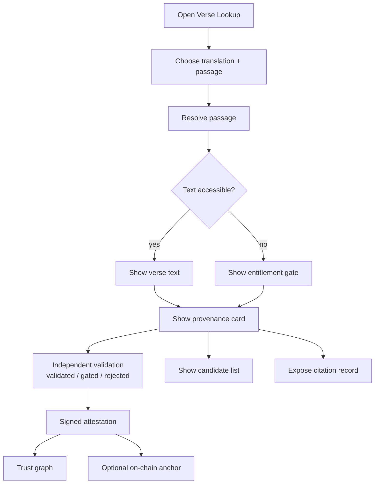
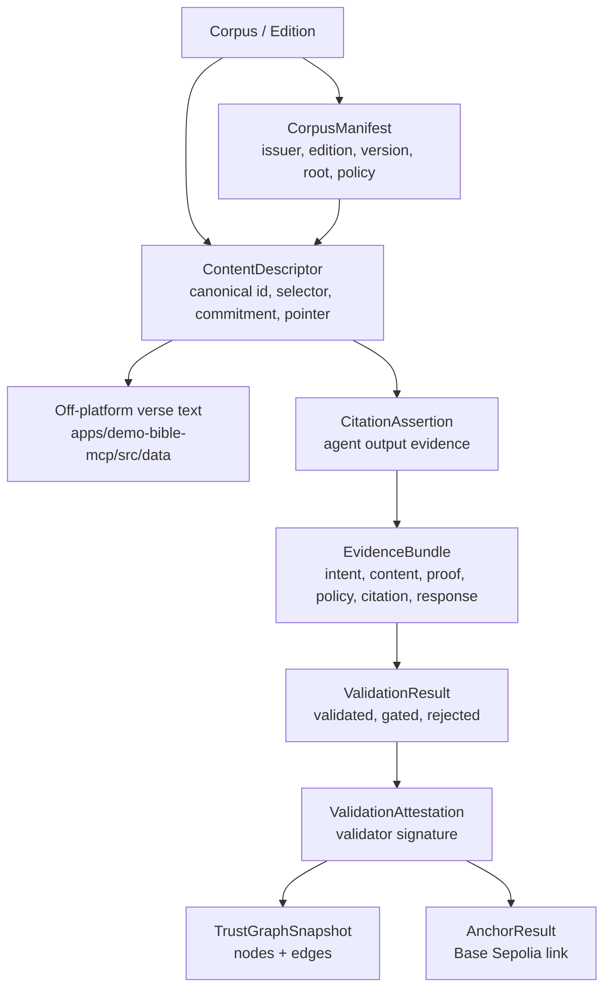
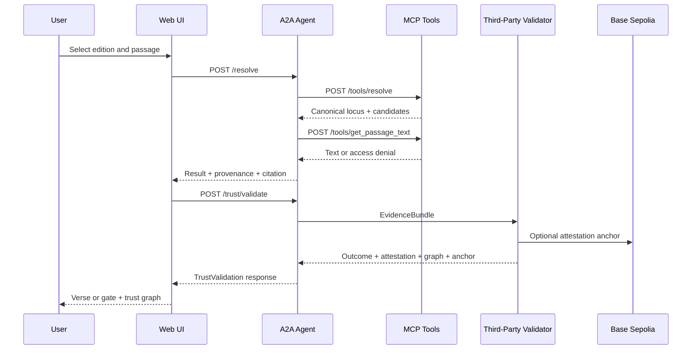

# Information Architecture

## Purpose

The demo presents scripture lookup as a user-facing reading experience backed by verifiable provenance. The information architecture separates what the user chooses, what the system resolves, what is allowed to be displayed, and what evidence proves the citation.

## Primary User Model

Users think in this order:

1. Choose a translation.
2. Choose a book, chapter, and verse.
3. Read the verse if access is allowed.
4. Inspect provenance if they want to understand why the result is trustworthy.
5. Validate the response through the independent validator.
6. Review the signed validation attestation and trust graph.
7. Review alternate candidates when more than one descriptor exists.

## User-Facing Objects

| Object | User Label | Meaning |
| --- | --- | --- |
| Edition | Translation | A specific published corpus version, such as `bsb` or `demo-licensed`. |
| Passage | Book, chapter, verse | The user's requested scripture reference. |
| Canonical locus | Canonical locus id | A normalized, scheme-independent identifier for the verse. |
| Candidate | Candidate | A content descriptor that could satisfy the canonical locus. |
| Commitment | Commitment | A cryptographic digest of normalized text. |
| Provenance | Provenance | The trust evidence for the selected candidate. |
| CitationAssertion | Citation record | The AI-safe output record binding the result to the descriptor and commitment. |
| Entitlement | Demo entitlement | A credential used to unlock non-public text. |
| Evidence bundle | Validation bundle | Machine-readable proof package checked by the third-party validator. |
| ZK membership proof | Private membership proof | Proof that the cited commitment belongs to the corpus without revealing the leaf/index. |
| Validation outcome | Validated / gated / rejected | Independent result returned by the validator. |
| ValidationAttestation | Validator attestation | Signed validator credential over the evidence bundle, checks, profile, and outcome. |
| Trust graph | Trust graph | Visual explanation of consumer, validator, A2A agent, issuer, descriptor, and profile relationships. |
| Anchor | On-chain anchor | Optional compact attestation hash recorded in `ValidationAttestationRegistry`. |

## Content Hierarchy

## Page Structure

The web app is organized as:

- Header: product name and provenance-oriented tagline.
- Picker card: edition, book, chapter, verse, and lookup action.
- Result card: resolved reference and verse text or access gate.
- Provenance card: canonical id, issuer, OSIS locus, access policy, commitment, and verification state.
- Candidate list: admitted and screened descriptor candidates.
- Citation details: raw `CitationAssertion` JSON.
- Validator result: optional machine-verifiable outcome from the independent validator.
- Trust graph card: outcome badge, validator name, profile, checks passed, attestation proof, optional Base Sepolia anchor, and graph SVG.
- Ask panel: topic-style question answer with signed citations and per-citation verification.

## Information Flow

## Trust Graph Labels

The SVG trust graph uses fixed relationship labels:

| Label | Meaning |
| --- | --- |
| `trusts validator` | The app accepts `demo-validator.agent` for the current profile. |
| `trusts profile` | The validator evaluated the output under a named profile. |
| `validated output` | The validator attested to one A2A run/output. |
| `cited descriptor` | The A2A agent cited a specific descriptor. |
| `issued descriptor` | The publisher/issuer issued the cited descriptor. |

## Naming Rules

- Use "translation" for users; use "edition" in technical docs and APIs.
- Use "passage" or "reference" for the user's input.
- Use "canonical locus" for the normalized scripture identity.
- Use "provenance" for the evidence card, not for the verse text itself.
- Use "candidate" for possible descriptors, because the resolver can return more than one.
