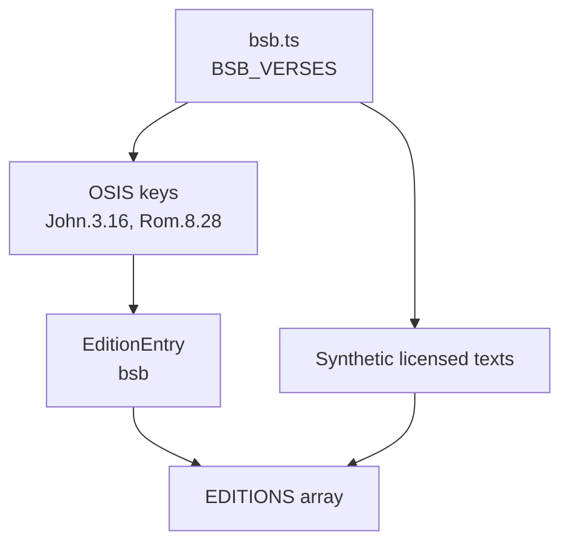
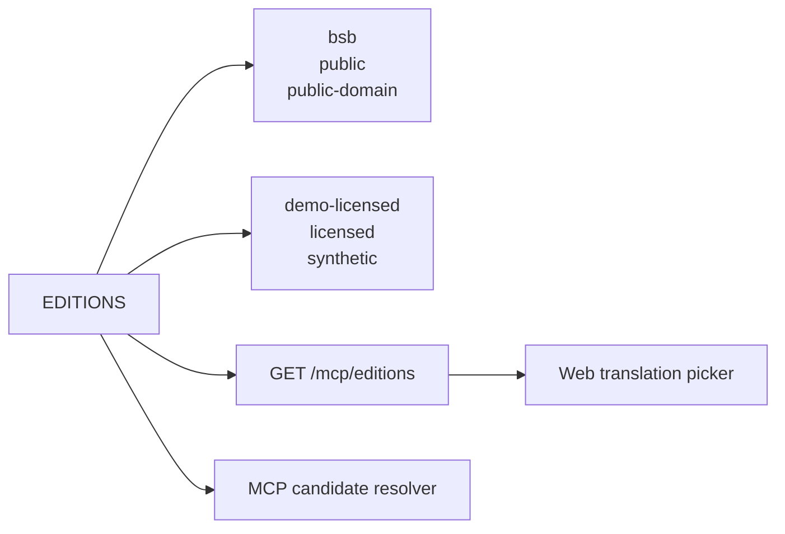
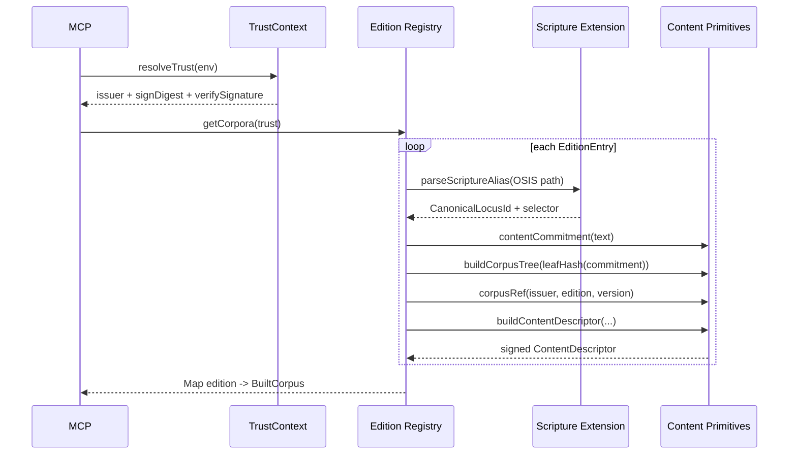
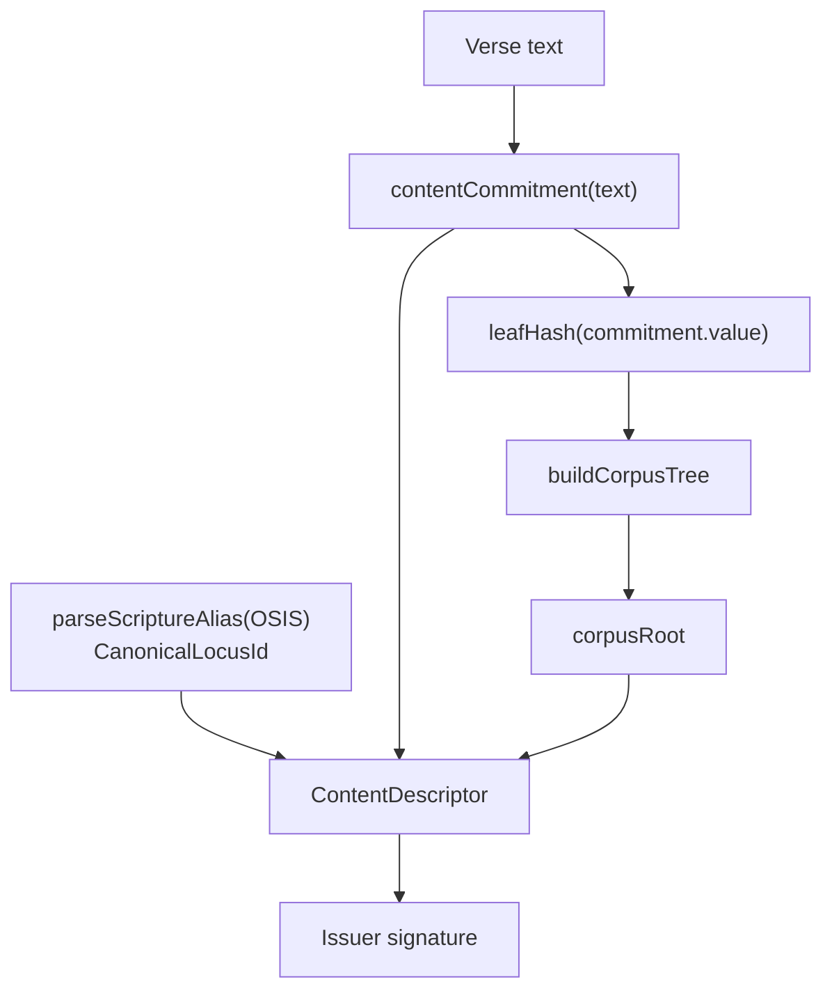
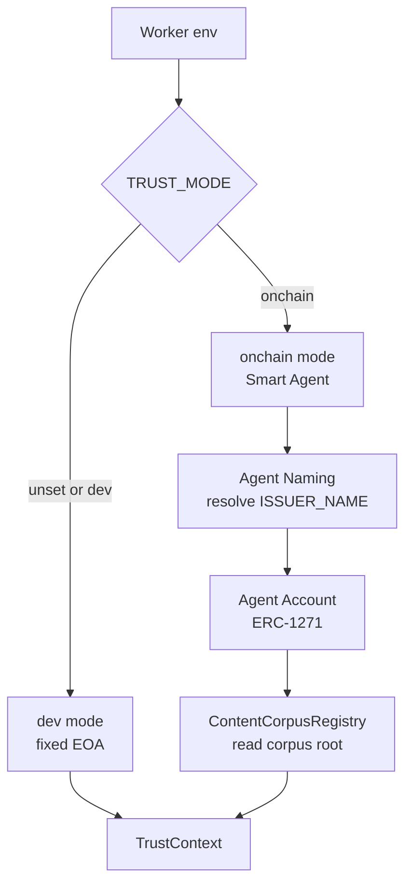
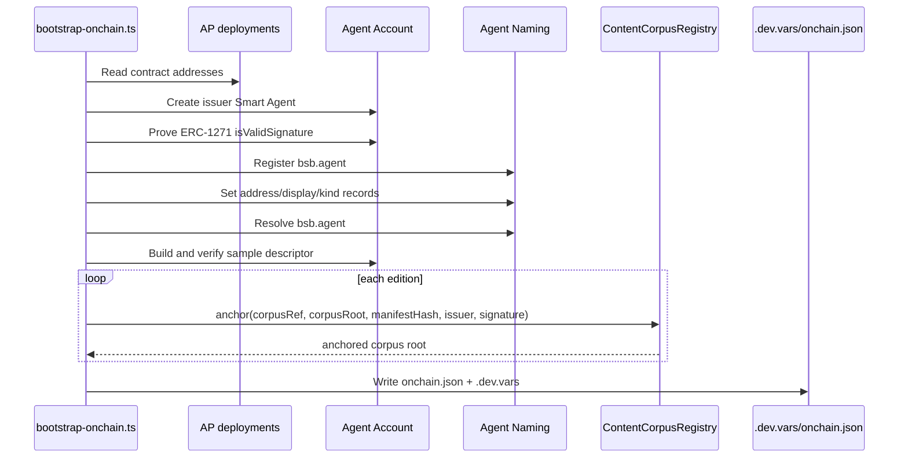
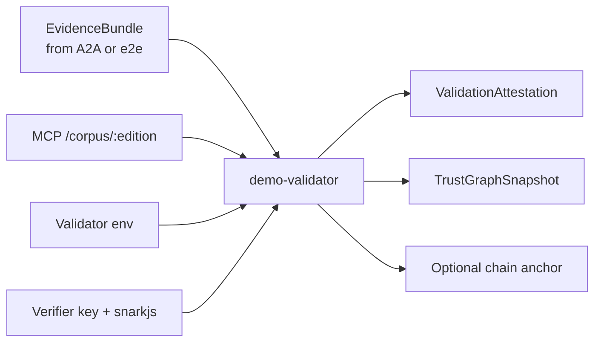
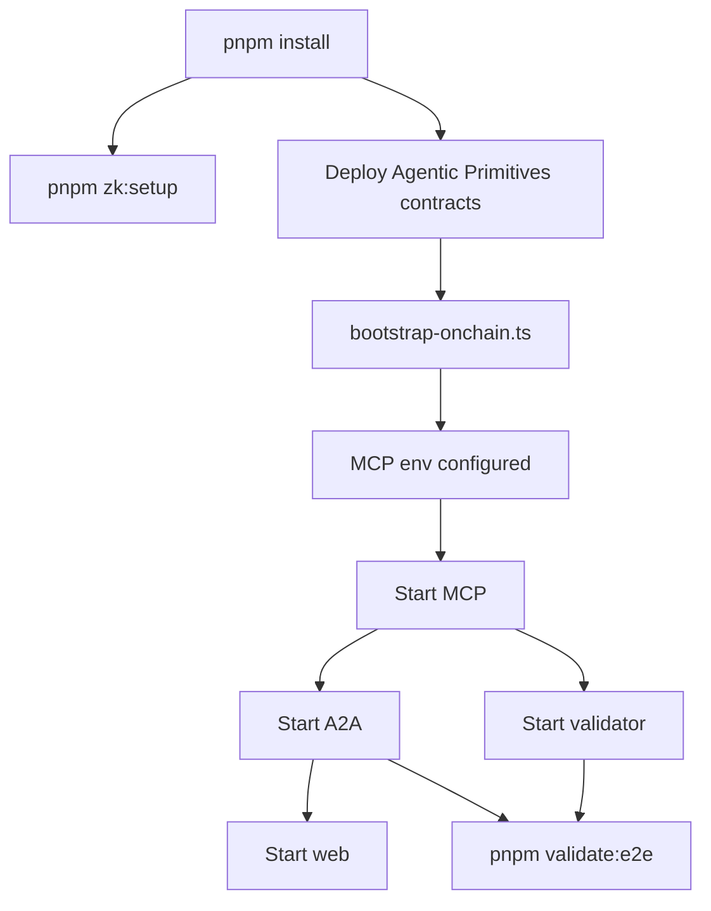

# Initialization and Data Sources

## Purpose

This document shows how scripture verse data, edition configuration, corpus registries, contract registries, and validator data sources are initialized across the demo.

The short version:

1. Verse text starts as off-platform app data.
2. Edition config turns text into named corpora.
3. Corpus initialization builds commitments, descriptors, Merkle roots, and manifests.
4. Trust context decides whether those descriptors are signed by the dev EOA or an on-chain Smart Agent.
5. On-chain bootstrap registers issuer naming data and anchors corpus roots.
6. MCP exposes edition, corpus, resolve, text, entitlement, and verification APIs.
7. A2A and validator consume those APIs to produce citations, evidence bundles, attestations, trust graphs, and optional anchors.

## Configured Data Sources

| Source | Location | Used By | Purpose |
| --- | --- | --- | --- |
| BSB verse text | `apps/demo-bible-mcp/src/data/bsb.ts` | MCP corpus builder | Public-domain scripture text, keyed by OSIS path. |
| Synthetic licensed text | `apps/demo-bible-mcp/src/editions/registry.ts` | MCP corpus builder | Mock licensed edition used to exercise entitlement gates. |
| Edition registry | `apps/demo-bible-mcp/src/editions/registry.ts` | MCP `/mcp/editions`, resolver, corpus builder | Configures editions, issuers, rights status, access policy, and text maps. |
| Scripture canon and parser | `@agenticprimitives/scripture-content-extension` | MCP resolver and corpus builder | Parses OSIS/common references into canonical scripture loci. |
| Content primitives | `@agenticprimitives/content-primitives` | MCP, A2A, validator | Builds commitments, descriptors, corpus trees, citations, and verification checks. |
| MCP runtime env | `apps/demo-bible-mcp/.dev.vars` or Cloudflare vars | MCP trust context | Selects dev vs on-chain trust and registry addresses. |
| Agentic Primitives deployments | `AP_DEPLOYMENTS` / deployed contract JSON | bootstrap script | Supplies Agent Account, Agent Naming, and `ContentCorpusRegistry` addresses. |
| Validator env | Vercel/local env | validator | Supplies trusted issuers, MCP URL, RPC URL, validator SA/signing, and optional attestation registry. |
| ZK setup artifacts | `packages/zk-membership/build/` and validator `vkey.ts` | e2e prover, hosted validator | Proves and verifies Groth16 membership. |

## Verse Data Initialization

The only real scripture text shipped in the demo is the public-domain BSB sample in `apps/demo-bible-mcp/src/data/bsb.ts`.

Important details:

- `BSB_EDITION = "bsb"`.
- `BSB_VERSION = "2023"`.
- Text is keyed by OSIS path, for example `John.3.16`.
- `demo-licensed` is generated from the same OSIS keys, but its text is synthetic placeholder text.
- The demo does not embed copyrighted licensed Bible text.

## Edition Registry Initialization

`EDITIONS` is the local source of truth for configured demo editions.

| Field | Meaning |
| --- | --- |
| `edition` | Stable edition id, such as `bsb` or `demo-licensed`. |
| `version` | Edition version. |
| `displayName` | User-facing translation name. |
| `issuerName` | Agent Naming style issuer name. |
| `language` | Language metadata. |
| `accessPolicy` | `public`, `licensed`, or `private`. |
| `rightsStatus` | `public-domain`, `licensed`, etc. |
| `texts` | OSIS-path to verse rendering map. |

## Corpus Build

MCP lazily builds corpora through `getCorpora(trust)`. Corpora are cached per issuer address so dev and on-chain modes do not collide.

Each built corpus contains:

- `entry`: the `EditionEntry`.
- `manifest`: `CorpusManifest` with `corpusRef`, `issuer`, `edition`, `version`, `scheme`, `corpusRoot`, `accessPolicy`, `proofPolicy`, and `licenseTermsHash`.
- `tree`: Merkle tree over descriptor commitment leaves.
- `byCanonicalId`: map from canonical scripture id to descriptor row.

## Descriptor and Commitment Construction

For each verse:

Each descriptor includes:

- `id`: `desc_<edition>_<canonicalId prefix>`.
- `canonicalId`: deterministic scripture locus id.
- `contentType`: `scripture.verse`.
- `issuer`: dev EOA or on-chain Smart Agent address.
- `selector`: parsed scripture selector.
- `commitment`: commitment to the actual text.
- `retrievalPointer`: `content://scripture.verse/<edition>/<osis>`.
- `proofPolicy`: `merkle-membership-v1`.
- `accessPolicy`: edition policy.
- `corpusRef`: issuer/edition/version corpus reference.

The descriptor points to text but does not contain text.

## Trust Context Initialization

MCP chooses one of two signing and verification strategies.

### Dev Mode

Default behavior:

- Uses fixed dev issuer key from `registry.ts`.
- Signs descriptors and entitlements with EOA recovery.
- Uses off-chain manifest `corpusRoot`.
- Good for local development and smoke tests.

### On-Chain Mode

Configured through environment variables:

| Env | Purpose |
| --- | --- |
| `TRUST_MODE=onchain` | Enables on-chain issuer trust. |
| `RPC_URL` | Chain RPC. |
| `CHAIN_ID` | Chain id. |
| `FACTORY` | Agent Account factory. |
| `ENTRY_POINT` | ERC-4337 entry point. |
| `REGISTRY` | Agent Naming registry. |
| `UNIVERSAL_RESOLVER` | Agent Naming universal resolver. |
| `CONTENT_REGISTRY` | `ContentCorpusRegistry` address. |
| `ISSUER_NAME` | Agent name, such as `bsb.agent`. |
| `ISSUER_SA` | Expected issuer Smart Agent address. |
| `ISSUER_OWNER_PK` | Owner key used to sign in the demo. |

On-chain mode:

- Resolves `ISSUER_NAME` through Agent Naming.
- Confirms it matches `ISSUER_SA`.
- Signs descriptor digests through the owner key in ERC-1271-compatible format.
- Verifies signatures through `AgentAccountClient.isValidSignature`.
- Reads anchored corpus roots from `ContentCorpusRegistry` when available.

## On-Chain Bootstrap

`apps/demo-bible-mcp/scripts/bootstrap-onchain.ts` initializes the on-chain trust environment.

The bootstrap writes MCP configuration so the worker can start in on-chain mode.

## Runtime APIs and Their Data Sources

| Endpoint | Data Sources | Returns |
| --- | --- | --- |
| `GET /health` | `TrustContext` | Mode, issuer, issuer name, anchoring flag. |
| `GET /mcp/editions` | `EDITIONS`, built corpora, trust issuer | Edition registry with `corpusRef`, `corpusRoot`, issuer, policy. |
| `GET /mcp/books` | Scripture extension `BOOKS` | Book table for picker. |
| `GET /corpus/:edition` | Built corpus descriptors | Ordered public commitments for validator ZK root derivation. |
| `POST /tools/resolve` | Scripture parser, built corpora, trust profile, optional on-chain root | Canonical locus, display reference, candidates, descriptors, proofs. |
| `POST /tools/get_passage_text` | Built corpus, source text map, entitlement verifier | Text or access denial. |
| `POST /tools/issue_entitlement` | Built corpus, trust credential signer | Signed entitlement VC. |
| `POST /tools/verify_citation` | Built corpus descriptor | Commitment match result. |

## Validator Data Sources

The validator uses three data sources:

| Source | Purpose |
| --- | --- |
| Evidence bundle | Claims to verify: canonical id, descriptor, proof, policy, citation, response. |
| `MCP_URL /corpus/:edition` | Ordered commitments for Poseidon root derivation. |
| `VALIDATOR_TRUSTED_ISSUERS` | Validator trust profile. |
| `VALIDATOR_RPC_URL` | Enables ERC-1271 checks and anchoring. |
| `VALIDATOR_SA` / `VALIDATOR_OWNER_PK` | Validator signing identity. |
| `ATTESTATION_REGISTRY` | Optional registry for attestation hash anchors. |
| ZK verification key | Verifies Groth16 membership proof public signals. |

## A2A Data Sources

A2A does not own scripture data. It orchestrates:

| A2A Feature | Data Source |
| --- | --- |
| `/editions` | MCP `/mcp/editions`. |
| `/books` | MCP `/mcp/books`. |
| `/resolve` | MCP `/tools/resolve` and `/tools/get_passage_text`. |
| `/issue-entitlement` | MCP `/tools/issue_entitlement`. |
| `/ask` | Local topic map plus MCP resolve/text calls. |
| `/verify` | Signed citation plus MCP `/tools/verify_citation`. |
| `/transparency` | In-memory citation log. |
| `/trust/validate` | MCP resolve/text output plus `VALIDATOR_URL /validate`. |

## Web Data Sources

The web app reads through the A2A base path:

| UI Area | API |
| --- | --- |
| Translation picker | `GET /a2a/editions`. |
| Book picker | `GET /a2a/books`. |
| Verse lookup | `POST /a2a/resolve`. |
| Licensed gate retry | `POST /a2a/issue-entitlement`, then `POST /a2a/resolve`. |
| Ask panel | `POST /a2a/ask`. |
| Citation verification | `POST /a2a/verify`. |
| Trust graph card | `POST /a2a/trust/validate`. |

## End-to-End Initialization Order

Local dev can skip the contract/bootstrap path and use dev EOA mode. Hosted/on-chain mode requires deployed Agentic Primitives contracts and environment variables.

## What Is Initialized Lazily

| Item | When Built |
| --- | --- |
| `TrustContext` | First MCP request, cached in `resolveTrust`. |
| Corpora | First call to `getCorpora(trust)`, cached per issuer address. |
| Descriptors | During corpus build. |
| Merkle trees | During corpus build. |
| Validator Poseidon root | During validation when `zkMembership` is present. |
| Validation attestation | During validator `/validate` after schema check. |
| Attestation anchor | During validator `/validate` when env is configured; best-effort. |

## Current Demo Data Boundaries

- Real public-domain BSB sample text is embedded in the MCP app.
- Mock licensed text is synthetic and exists only to exercise entitlement behavior.
- Verse text is never placed on-chain.
- MCP exposes public commitments through `/corpus/:edition`, not verse text.
- On-chain roots anchor corpus integrity, not content rights by themselves.
- Validator attestation anchors are compact hashes; full bundles and checks remain off-chain.
