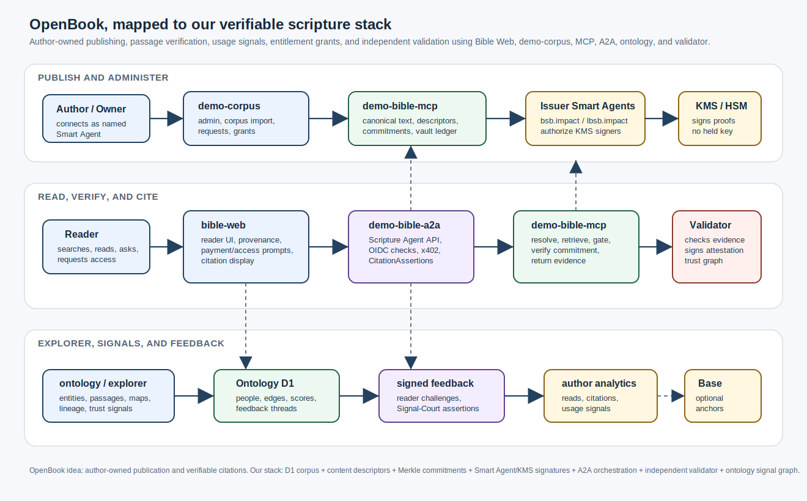
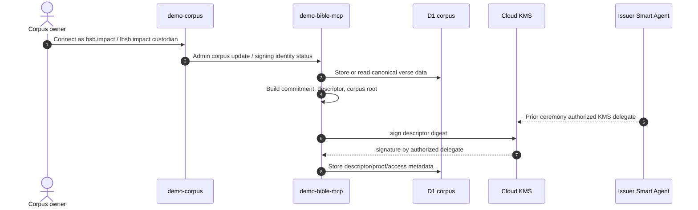
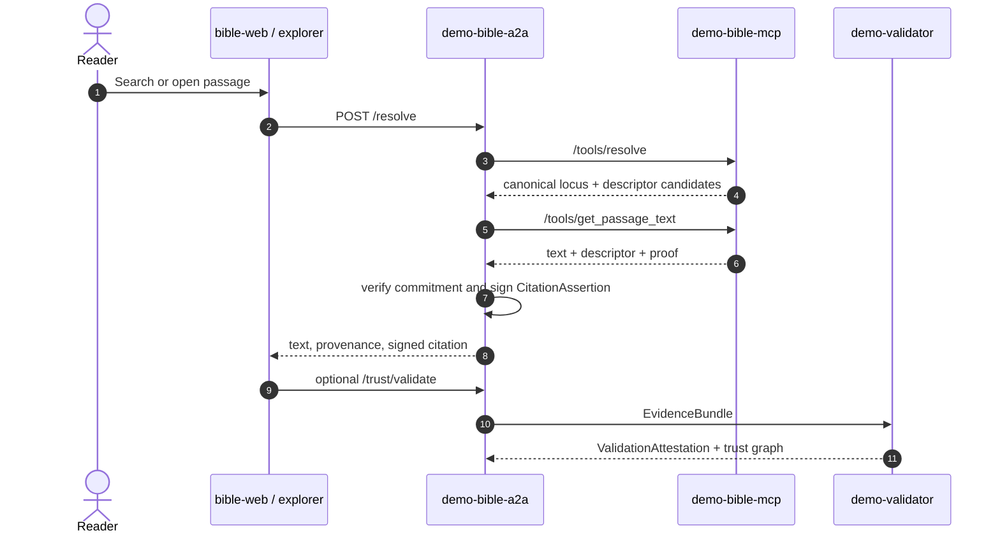
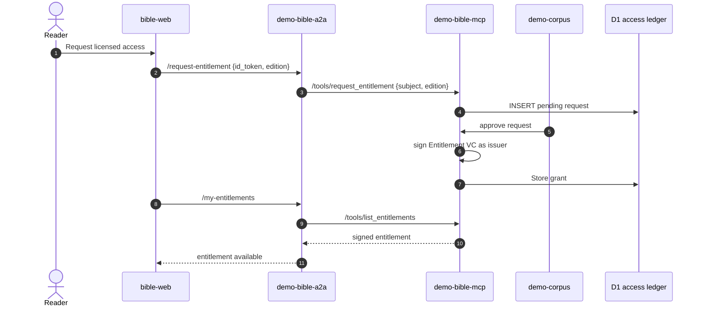

# OpenBook

Project OpenBook  
Author(s): Graham Malone, adapted for the verifiable-content-demo architecture  
Last Updated: Jul 1, 2026  
Status: Draft

## Overview

OpenBook is the product direction behind the current Bible verification demo: an open publishing and verification system where the publisher owns the work, the text can be independently verified, and citations carry machine-checkable provenance.

The original OpenBook PRD describes Arweave, Bitcoin Ordinals, Base pointer records, reader attestations, citation search, translation bounties, and author analytics. Our current implementation uses different infrastructure, but the thesis is the same:

- publish canonical content under a named owner identity;
- hash content into commitments and Merkle roots;
- sign descriptors and access credentials with named Smart Agents;
- let readers verify exact passages and citations;
- collect feedback, usage, and trust signals without relying on a platform gatekeeper.

This document maps that OpenBook flow onto the current demo stack: `demo-bible-web`, `demo-corpus`, `demo-bible-a2a`, `demo-bible-mcp`, `demo-validator`, and `demo-bible-ontology`.



## Product Promise

OpenBook for this repo is not a general book marketplace yet. It is a scripture-first proof that the model works:

```text
canonical text -> descriptor -> commitment -> signed citation -> independent validation
```

For Bible content, the "book" is a corpus edition such as `bsb` or `lbsb`. The platform can prove which edition, verse, descriptor, commitment, issuer, access policy, and responding agent were involved in a read or citation.

## Mapping From The Original PRD To Our Stack

| OpenBook PRD idea | Our current technology |
| --- | --- |
| Author-owned book | Corpus owner Smart Agent, e.g. `bsb.impact` or `lbsb.impact`. |
| Upload markdown or EPUB | `demo-corpus` manages corpus data and admin workflows. |
| Canonical book hash | `demo-bible-mcp` builds canonical scripture loci, verse commitments, corpus roots, and descriptors. |
| Arweave payload | Today: D1-backed BSB corpus in `demo-bible-mcp`. Future: external immutable store can replace or supplement D1. |
| Ordinals Genesis Inscription | Today: Smart Agent issuer signatures and optional Base Sepolia anchors. Future: Bitcoin/Arweave anchor can be added as another proof layer. |
| Reader app | `demo-bible-web` and the ontology/explorer UI. |
| Verification API | `demo-bible-a2a` `/resolve`, `/verify`, and `/trust/validate`, backed by MCP and validator checks. |
| Citation primitive | A2A-signed `CitationAssertion` tied to descriptor, commitment, run id, and output id. |
| Author dashboard | `demo-corpus` plus ontology/signal dashboards. |
| Usage and citation tracking | Ontology signals, feedback threads, transparency log, and future crawler/indexer. |
| Translation marketplace | Future derivative-corpus workflow: request, approve, publish translated edition, sign descriptors under a named issuer. |
| Monetisation | Existing entitlement grants, subscriptions, prepaid access, and x402 payment flows for `lbsb`. |

## Applications

| App | OpenBook role | Current responsibility |
| --- | --- | --- |
| `demo-bible-web` | Reader app | Search, read, pay/request access, render provenance, citations, and validation state. |
| `demo-bible-ontology` | Explorer | Knowledge graph, people/entities, maps, lineage, trust signals, and feedback threads. |
| `demo-corpus` | Publisher/admin console | Manage corpus data, issuer identity, signing key authorization, entitlement requests, grants, and revocations. |
| `demo-bible-a2a` | Public agent/API | Browser-facing orchestration, OIDC checks, x402 handling, citation signing, validator facade. |
| `demo-bible-mcp` | Corpus archive/vault | Canonical text, descriptors, commitments, Merkle roots, access ledgers, entitlements, final text gate. |
| `demo-validator` | Independent verifier | Re-checks evidence bundles and signs `ValidationAttestation` results. |

## Core User Needs

Authors and corpus owners need to know that a text is published under their authority, not under a hidden platform key. In our implementation, the issuer is a named Smart Agent, and its KMS signer is authorized through an owner ceremony.

Readers and researchers need to verify that a passage is real and came from the claimed source. Our implementation answers that with descriptors, commitments, issuer signatures, citation assertions, and validator attestations.

Corpus owners need to grant access without handing out raw secrets. Our implementation uses request -> grant -> deliver: readers request entitlement, owners approve in `demo-corpus`, MCP stores the signed entitlement, and readers pick it up through A2A.

Explorers and reviewers need to challenge signals and record feedback. Our implementation routes feedback through A2A/MCP, signs a feedback assertion, and stores it in the ontology graph.

## Flow 1: Publish Or Register Corpus Content

The original PRD has "author uploads a book, platform canonicalizes it, hashes it, uploads to Arweave, and anchors it." Our version is:

1. Corpus owner connects through Global.Church identity as the relevant named Smart Agent custodian.
2. `demo-corpus` manages or imports corpus rows.
3. `demo-bible-mcp` canonicalizes verse loci and builds commitments.
4. MCP builds a Merkle corpus root and per-verse `ContentDescriptor` records.
5. The issuer Smart Agent's authorized KMS key signs descriptor digests.
6. The descriptor carries both the KMS signature and the delegation leaf proving the issuer authorized that KMS key.



## Flow 2: Reader Resolves And Verifies A Passage

The original PRD's reader loads content from permanent storage and verifies text against a canonical artifact. Our version:

1. Reader searches or opens a passage in `demo-bible-web` or the explorer.
2. Browser calls `demo-bible-a2a`, not MCP directly.
3. A2A asks MCP to resolve candidates and retrieve text.
4. MCP gates access, returns text and proof material.
5. A2A verifies commitment and signs a `CitationAssertion`.
6. Optional validator flow independently verifies the full evidence bundle.



## Flow 3: Request, Grant, Deliver Entitlement

This is the current analogue to OpenBook monetisation and controlled access, without DRM as the core thesis.

1. Reader connects and requests access.
2. `demo-bible-a2a` verifies the reader id token.
3. MCP records the entitlement request.
4. Owner reviews the queue in `demo-corpus`.
5. Approval issues a signed entitlement VC.
6. Reader picks it up with `/my-entitlements`.
7. Future reads present the entitlement, and MCP performs the final gate.



## Flow 4: Explorer Signals And Feedback

The original PRD wants authors to see where work is being read, cited, translated, or scraped. Our current explorer starts that path with ontology signals and feedback:

1. Explorer displays people, passages, edges, scores, and trust signals.
2. Reader challenges or comments on a signal.
3. A2A/MCP signs a feedback assertion.
4. Ontology D1 stores the feedback thread.
5. Future analytics can join reads, citations, validator results, feedback, and web-crawler hits into an author/corpus dashboard.

## Success Metrics For This Stack

| Metric | MVP target |
| --- | --- |
| Corpus owners with signed issuer/KMS bindings | 4 named identities bound and verified. |
| Public passage resolves | 1,000 cumulative verified reads. |
| Licensed access lifecycle | At least one request -> grant -> deliver flow completed end-to-end. |
| Verification API usage | 500+ `/resolve` or `/trust/validate` calls per month. |
| Feedback assertions | 100 signed feedback assertions against ontology signals. |
| Unauthorized content changes | Zero accepted descriptors without valid issuer/KMS authorization. |

## Requirements

### P0

- Corpus owner can connect as a named Smart Agent custodian and authorize the issuer KMS key.
- MCP can build and sign descriptors for public and licensed editions.
- Bible Web can resolve and render a public passage with provenance.
- Licensed read is gated by grant, subscription, prepaid, or x402 settlement.
- Validator can independently verify an evidence bundle and sign the result.
- Explorer can show ontology links and signed feedback threads.

### P1

- Corpus dashboard shows reads, citations, access requests, grants, and feedback.
- Browser extension or API accepts pasted text and returns matching passage candidates.
- Derivative/translation edition can be published as a new corpus with its own issuer and descriptors.
- Citation graph explorer links passages, entities, readers/researchers, and validator attestations.

## Non-Functional Requirements

Performance:

- Exact passage resolve should return within 500 ms from warm Worker/D1 paths.
- Validator evidence checks should return within 3 seconds for non-ZK validation.
- Explorer graph calls should stay responsive for entity pages and signal courts.

Security:

- Issuer authority is rooted in named Smart Agents and ERC-1271 verification.
- Operational signing keys live in KMS/HSM and are authorized by issuer delegation.
- A2A-to-MCP calls use service MACs, but user authority still comes from id tokens, entitlements, payment state, or delegation.
- Admin writes require connected owner identity; subject ids come from verified tokens, not typed form input.

Reliability:

- The system should fail closed when issuer signing, entitlement verification, or validator verification cannot be checked.
- D1 remains the current source of truth for corpus/access state; future immutable storage can be added without changing the proof model.

## Out Of Scope For This Repo Today

- Arweave permanent payload storage.
- Bitcoin Ordinals Genesis Inscriptions.
- General EPUB/markdown authoring workflow.
- Native mobile app.
- DRM or encrypted-by-default public books.
- Full translation bounty marketplace.
- AI-training crawler and public scrape detection.

## Open Questions

- Should immutable storage be Arweave-first, Base-anchor-first, or content-addressed storage plus optional premium Bitcoin inscription?
- What is the canonicalization spec for non-scripture books: paragraph ids, Unicode normalization, whitespace rules, footnotes, front matter, and editions?
- Should translations be approved only by the original author, or by an author-selected reviewer quorum?
- Should the citation crawler be open source, or should only the verification API be public?
- How do pseudonymous authors later reveal or prove real-world identity without weakening the original on-chain authorship record?

## Roadmap

| Milestone | Status | Notes |
| --- | --- | --- |
| Scripture corpus proof | In progress | BSB/lBSB descriptor, entitlement, and validation flows. |
| Corpus owner dashboard | In progress | `demo-corpus` is the admin surface. |
| Verification API | In progress | A2A/MCP/validator already provide the primitives. |
| Explorer signal graph | In progress | Ontology app has graph, signals, scores, and feedback. |
| Book-general canonicalization | Not started | Needed before non-scripture OpenBook publishing. |
| Immutable payload storage | Not started | Arweave/IPFS/Bitcoin anchoring are future storage layers. |
| Translation marketplace | Not started | Can reuse entitlement, issuer, and derivative-corpus patterns. |

## Recommended MVP Framing

Launch the current stack as "OpenBook for verifiable scripture" rather than as a general Amazon replacement. The narrow wedge is stronger:

```text
Bible passages are resolved, cited, challenged, granted, paid for, and validated
with cryptographic provenance.
```

Once that works with a trusted Christian publishing cohort, the same architecture can expand to books, translations, author dashboards, and citation tooling.

## What Is Not Already Working Yet

The current repo proves the trust pattern, but it is not yet the full OpenBook product described in the PRD. The most important distinction:

```text
Current repo = verifiable scripture corpus demo
OpenBook spec = general author-owned publishing platform
```

### Not Working Yet In The Current Repo

- General author onboarding for arbitrary books is not built. `demo-corpus` is an admin console for Bible corpus data, not a polished author publishing portal.
- Markdown/EPUB upload, parsing, canonical normalization, cover image handling, and book manifest generation are not built.
- Arweave/Irys permanent payload publishing is not implemented.
- Bitcoin Ordinals Genesis Inscription anchoring is not implemented.
- A Base pointer registry for OpenBook book records, translation bounties, paid mints, and citation anchors is not implemented.
- Reader app support for arbitrary books at `openbook.xyz/book/[id]` is not built. The current reader is scripture-focused.
- Offline PWA pinning of full books is not built.
- AR.IO gateway-signed read attestations are not built.
- Public paste-a-passage fuzzy search across all published books is not built. Current verification is strongest when the caller provides scripture reference/edition context.
- Browser extension, JS/Python SDK, and webhook integrations for citation tools are not built.
- Translation bounty marketplace is not built.
- Translator staking, delivery review, escrow release, and on-chain translator reputation are not built.
- Derivative translation publishing as linked OpenBook works is not built.
- Author analytics for global reads, citations, scrapes, and LLM training-data hits are not built.
- Web crawler / AI-training audit mode is not built.
- Paid mint tiers, numbered collector NFTs, and tip jars are not built.
- Author public profiles, author passports, and reader passports are not built.
- Production scale targets from the PRD, such as 50,000 books, 5M monthly readers, or 1M verification queries/day, have not been validated.

### Working Or Partially Working Today

- Scripture content can be resolved through `demo-bible-a2a` and `demo-bible-mcp`.
- `demo-bible-mcp` can build commitments, descriptors, corpus roots, and evidence for Bible passages.
- Named Smart Agent issuers and delegated KMS signing are the intended production trust model.
- `demo-bible-a2a` can return signed `CitationAssertion` evidence.
- `demo-validator` can independently check evidence bundles and sign validation outcomes.
- `demo-corpus` provides the beginning of the owner/admin surface for corpus management and entitlement approval.
- Entitlement request -> grant -> pickup flows exist for licensed scripture access.
- x402/subscription/prepaid access lanes exist for licensed BSB flows.
- `demo-bible-ontology` provides an explorer-style graph, signals, scores, and signed feedback threads.

### Needs To Be Improved Before OpenBook MVP

- Define a strict canonical book format for non-scripture works: Unicode normalization, whitespace rules, paragraph ids, headings, footnotes, front matter, editions, and manifests.
- Generalize descriptors from verse-level scripture loci to book/chapter/paragraph-level OpenBook loci.
- Add immutable payload storage integration, probably Arweave/Irys first, with optional Bitcoin inscription anchoring.
- Add a production book publishing pipeline in `demo-corpus` or a new author app.
- Add a reader app that loads arbitrary OpenBook works from immutable storage while preserving the current provenance UI patterns.
- Build an indexed hash/fuzzy-match verification service for pasted passages.
- Add author profile and dashboard surfaces for reads, citations, feedback, grants, translations, and usage signals.
- Build translation bounty contracts and review workflows.
- Decide whether citation/usage crawling is open-source infrastructure, a hosted service, or both.
- Harden production custody: author wallet onboarding, embedded-wallet policy, KMS recovery, key rotation, audit logs, and no shared-master social custody for production.
- Add rate limits, API keys, and abuse controls for high-volume verification callers.
- Add end-to-end tests proving publication, verification, entitlement, citation, validation, and revocation across the full OpenBook flow.

### Practical Next Build Order

1. Finalize the canonical book-hash spec.
2. Generalize MCP descriptors from scripture verses to book paragraphs.
3. Add immutable storage publishing and retrieval.
4. Build the author upload/profile workflow.
5. Build paste-a-passage verification.
6. Add author analytics and citation graph.
7. Add translation bounties and derivative-work publishing.
