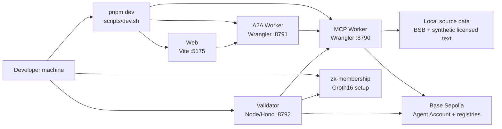
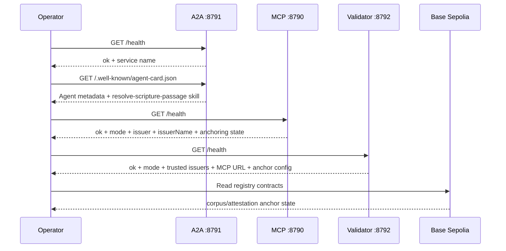
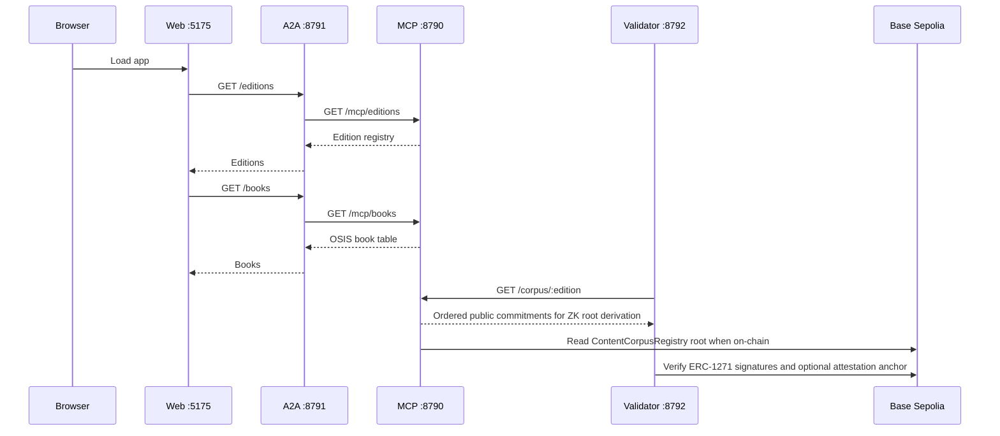
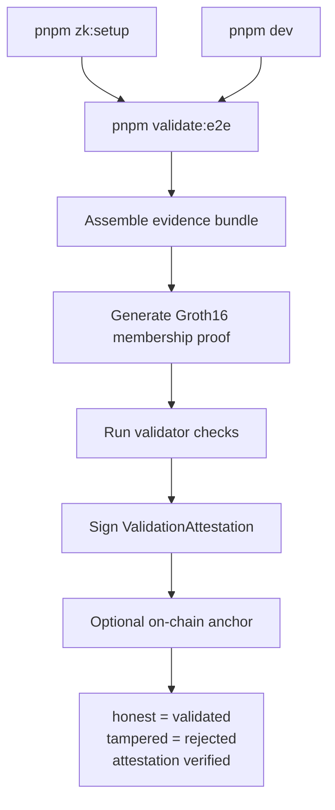
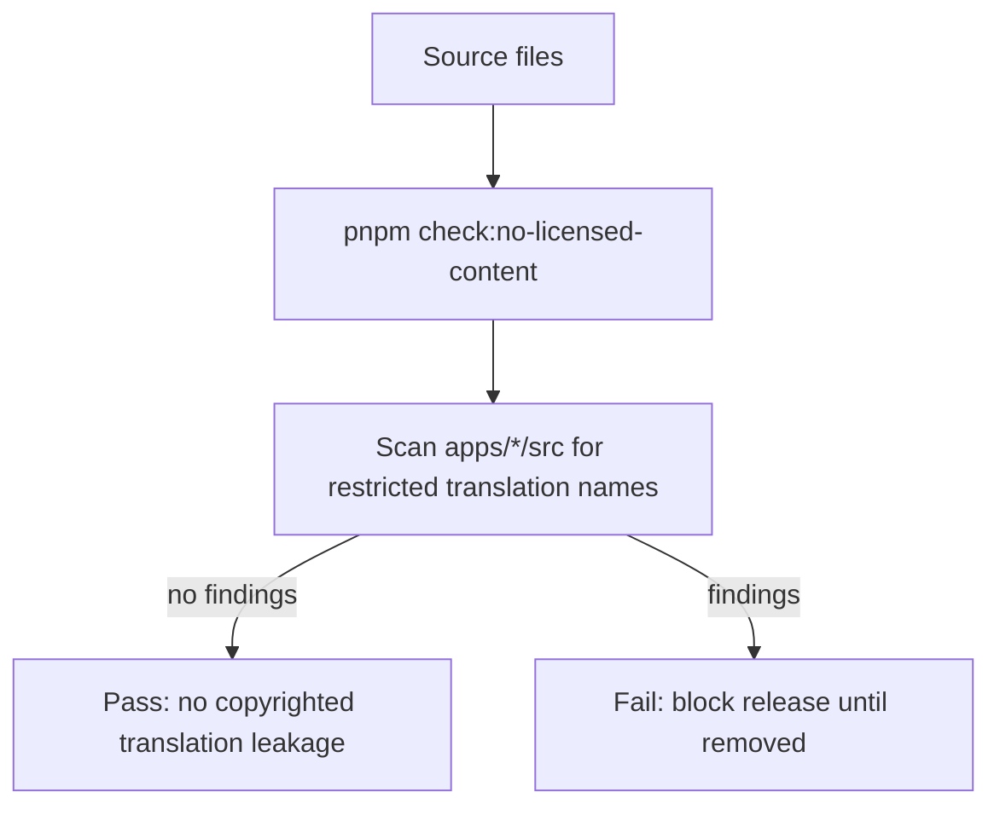

# Operational Architecture

## Purpose

The demo runs locally and as hosted services. The web app serves the UI, the A2A worker provides the agent-facing orchestration surface, the MCP worker owns content resolution and policy, and the validator independently checks agent evidence bundles. The ZK package provides Groth16 membership proofs for privacy-preserving corpus membership. Hosted mode uses Cloudflare for web/A2A/MCP, Vercel for the validator, and Base Sepolia for Smart Agent signatures and registry anchors.

## Runtime Topology

## Services

| Service | Package | Port | Responsibility |
| --- | --- | --- | --- |
| Web | `@verifiable-content-demo/bible-web` | `5175` | React UI, picker, result display, provenance card. |
| A2A | `@verifiable-content-demo/bible-a2a` | `8791` | Agent card, editions/books proxy, resolve orchestration, citation building. |
| MCP | `@verifiable-content-demo/bible-mcp` | `8790` | Edition registry, scripture tools, corpus build, policy checks, entitlement verification, audit. |
| Validator | `@verifiable-content-demo/validator` | `8792` | Independent evidence-bundle validation and `validated/gated/rejected` outcomes. |
| ZK package | `@verifiable-content-demo/zk-membership` | n/a | Circom/snarkjs Groth16 setup, proof generation, and proof verification. |
| Contracts | Agentic Primitives deployments | Base Sepolia / local Anvil | Agent Naming, Agent Account ERC-1271, `ContentCorpusRegistry`, and optional `ValidationAttestationRegistry`. |

## Commands

| Command | Use |
| --- | --- |
| `pnpm dev` | Run MCP, A2A, and web together. |
| `pnpm dev:mcp` | Run only the MCP worker. |
| `pnpm dev:a2a` | Run only the A2A worker. |
| `pnpm dev:web` | Run only the React/Vite app. |
| `pnpm validator` | Run the independent validator service on `:8792`. |
| `pnpm zk:setup` | Compile the circuit and run local Groth16 trusted setup. |
| `pnpm validate:e2e` | Assemble an evidence bundle with ZK proof, call the hosted/local validator, verify attestation signature, graph edge, and optional anchor. |
| `pnpm build` | Build all workspace packages. |
| `pnpm typecheck` | Typecheck all workspace packages. |
| `pnpm smoke` | Run the in-process proof flow without servers. |
| `pnpm check:no-licensed-content` | Ensure copyrighted translation text is not embedded. |

## Health and Discovery

## Operational Flow

## Validator Operations

The validator can run as a service with `pnpm validator` or as an end-to-end scenario with `pnpm validate:e2e`. In hosted mode, `VALIDATOR_URL=<hosted validator> pnpm validate:e2e` targets live Cloudflare A2A/MCP services and the Vercel validator.

The validator checks schema, canonical reference, descriptor signature and keccak Merkle inclusion, issuer trust profile, commitment-to-text, policy/entitlement, signed citation binding, response binding, and optional Groth16 membership. If validation reaches the attestation step, it signs a `ValidationAttestation`, returns a trust graph snapshot, and attempts a best-effort on-chain attestation anchor when configured.

## Audit and Policy

The MCP worker writes structured audit events through `@agenticprimitives/audit` using a console sink. Audited actions include:

- `content.resolve`
- `content.text.access`
- `content.entitlement.verify`
- `content.entitlement.issue`
- `content.citation.verify`

Tool access is classified with `@agenticprimitives/tool-policy`. Current demo tools are service-only, service-HMAC classified, and low risk. The policy gate is evaluated before protected tool execution.

## Content Safety Controls

Operational rule: the repo ships public-domain text only. The `demo-licensed` edition is synthetic placeholder text used to exercise the entitlement gate.

## Environment and Configuration

| Setting | Owner | Default |
| --- | --- | --- |
| `MCP_URL` | A2A worker | `http://127.0.0.1:8790` |
| `MCP_URL` | Validator | `http://localhost:8790` |
| `VALIDATOR_TRUSTED_ISSUERS` | Validator | Demo dev issuer EOA |
| `VALIDATOR_URL` | A2A worker / e2e script | Hosted validator URL in production. |
| `VALIDATOR_RPC_URL` | Validator | Enables on-chain ERC-1271 verification and attestation anchoring. |
| `VALIDATOR_SA` | Validator | Optional validator Smart Agent address used as attestation issuer. |
| `VALIDATOR_OWNER_PK` | Validator | Owner key used to sign as validator Smart Agent in hosted/demo mode. |
| `ATTESTATION_REGISTRY` | Validator | Optional `ValidationAttestationRegistry` address. |
| `VALIDATOR_ANCHOR_PK` | Validator | Optional funded relayer key for anchoring attestation hashes. |
| `BASE_SEPOLIA_RPC` | e2e script | Optional RPC override for attestation and anchor verification. |
| `PORT` | Validator | `8792` |
| `A2A_PUBLIC_ORIGIN` | A2A worker | Request origin |
| `A2A_BASE` | Web app | `/a2a` |
| `TRUST_MODE` | MCP worker | `dev`; `onchain` enables Agent Naming, ERC-1271, and optional corpus-root anchoring. |
| `CONTENT_REGISTRY` | MCP worker | Optional on-chain `ContentCorpusRegistry` address. |

The A2A and MCP workers run through Wrangler. Local persistence is configured in each app's `wrangler.toml` and dev script.

## Failure Modes

| Failure | User Effect | Operational Check |
| --- | --- | --- |
| MCP down | Editions, books, or resolve fail through A2A. | `GET :8790/health` |
| A2A down | Web app cannot load data or resolve passages. | `GET :8791/health` |
| Unknown edition | Text retrieval returns `404`. | Check `EDITIONS` registry. |
| Bad reference | Resolve returns `400`. | Check scripture alias parsing. |
| Entitlement denied | User sees gated text state. | Inspect MCP audit logs. |
| Commitment mismatch | Provenance shows failed verification. | Rebuild corpus and verify source text. |
| ZK setup missing | `validate:e2e` or proof generation fails. | Run `pnpm zk:setup`; ensure `circom` is on `PATH`. |
| Validator cannot fetch corpus | ZK membership check fails. | Check MCP is running and `GET :8790/corpus/:edition` works. |
| Untrusted issuer | Validator returns `rejected`. | Configure `VALIDATOR_TRUSTED_ISSUERS` or trust profile. |
| Validator URL missing | A2A `/trust/validate` returns `503`. | Set `VALIDATOR_URL` in A2A environment. |
| Attestation anchor disabled | Validation still succeeds but no on-chain anchor is returned. | Set `ATTESTATION_REGISTRY`, `VALIDATOR_ANCHOR_PK`, and `VALIDATOR_RPC_URL`. |
| Anchor RPC slow | Validation returns an anchor timeout/error but does not fail validation. | Retry or inspect validator logs and Base Sepolia RPC health. |
