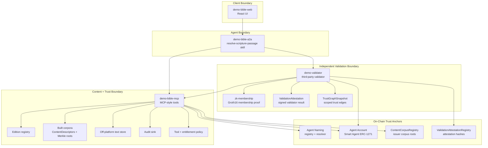
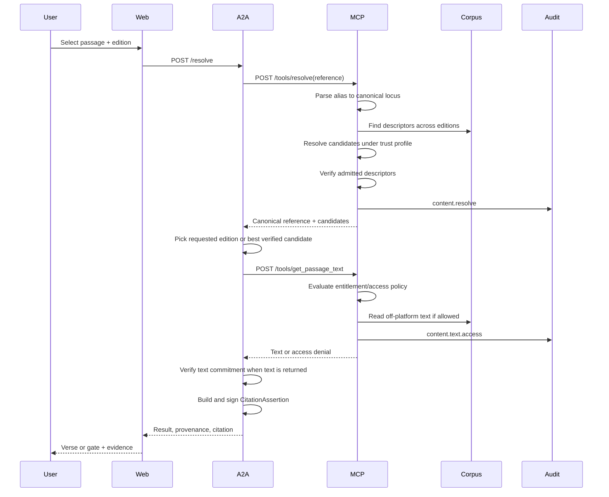
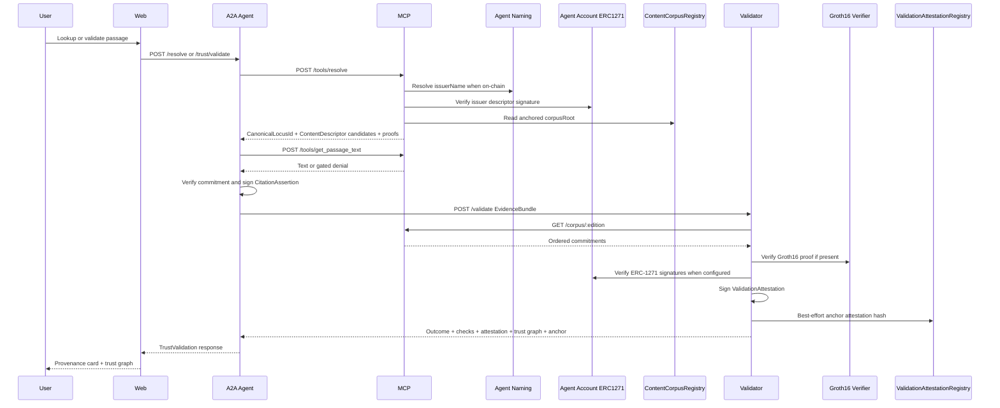
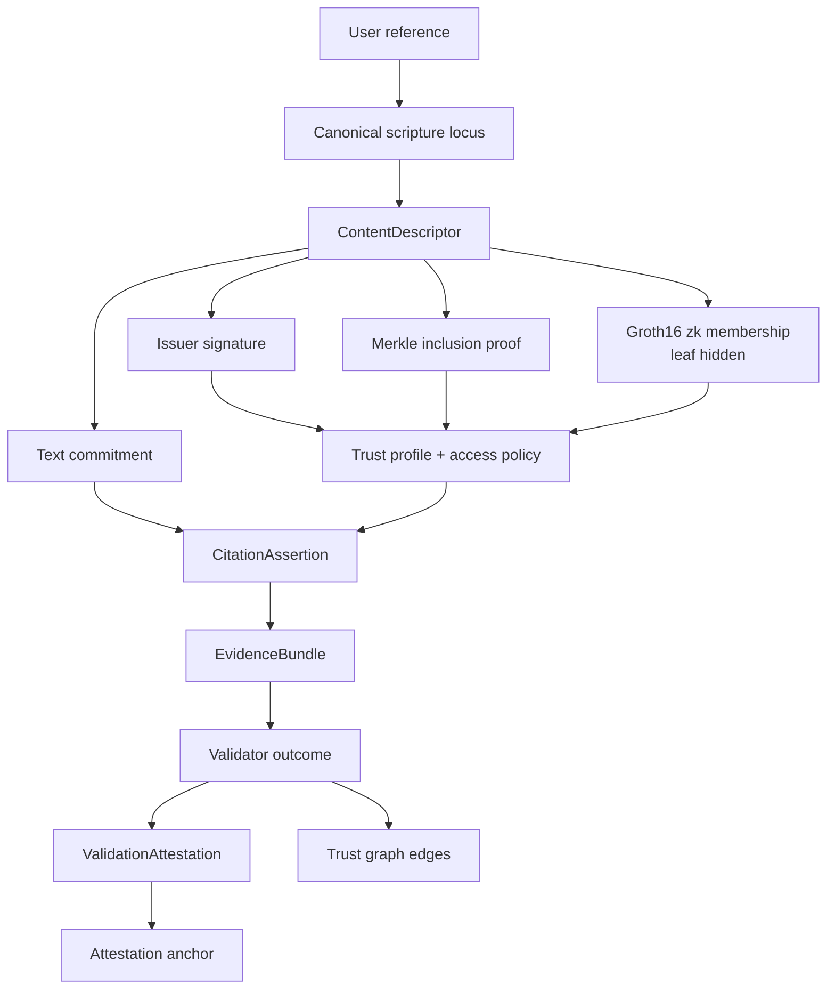
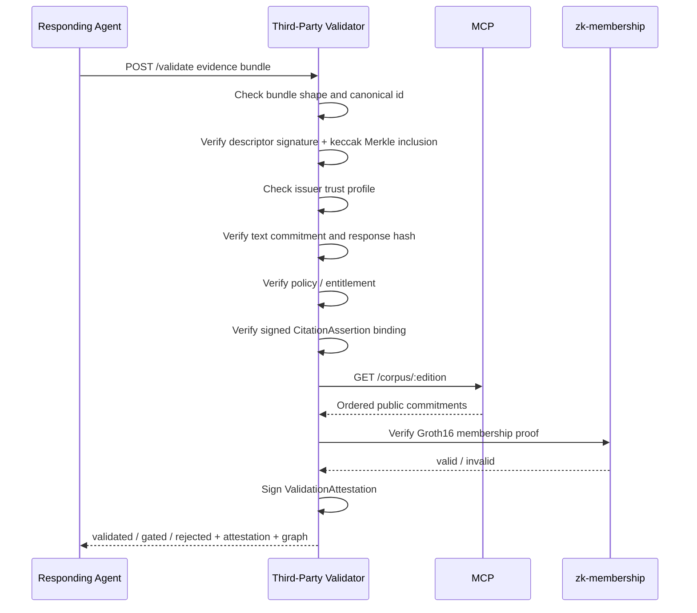
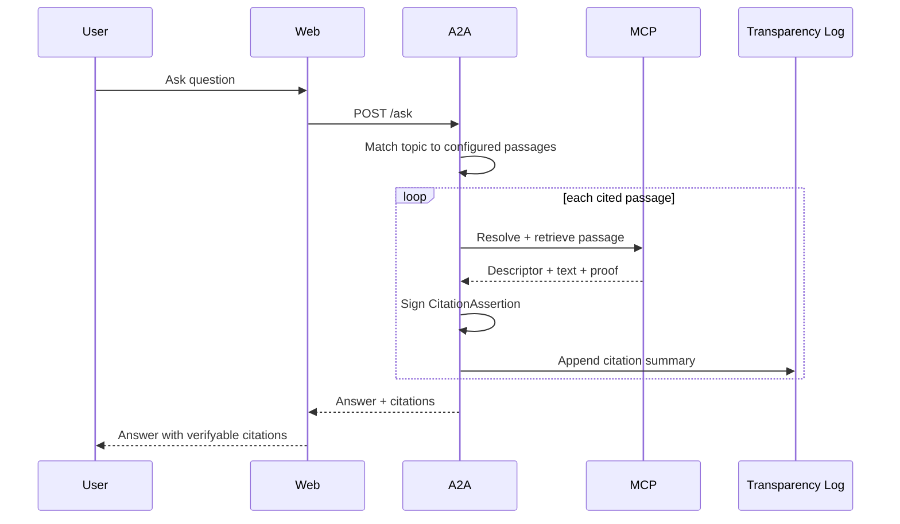
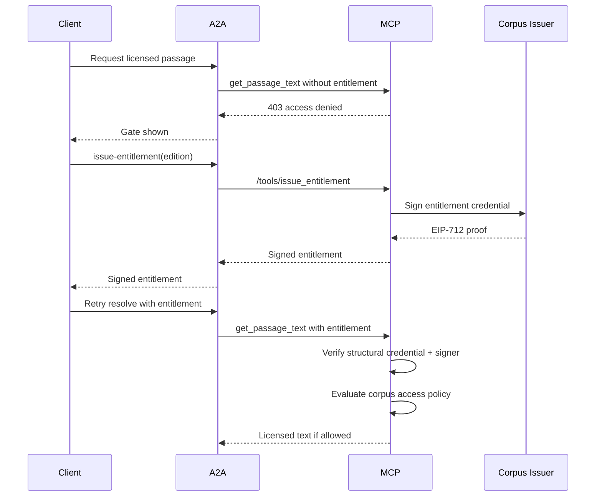
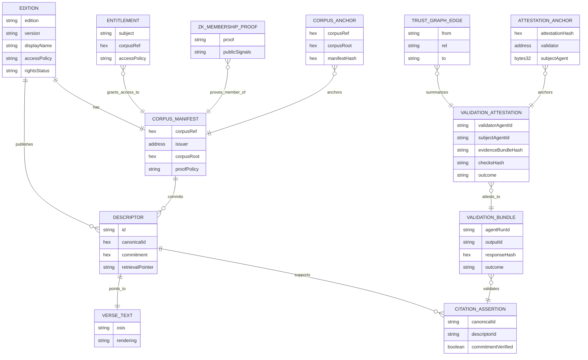

# System Architecture

## Purpose

The system demonstrates verifiable scripture lookup using a UI, an A2A orchestration agent, an MCP content/tool server, an independent validator, a ZK membership verifier, and on-chain trust anchors. Trust is attached to descriptors, commitments, issuer signatures, corpus roots, optional zk membership proofs, policy decisions, signed citations, signed validation attestations, trust graph edges, and validator outcomes rather than to the UI.

## Component View

## Responsibilities

| Component | Responsibility | Does Not Own |
| --- | --- | --- |
| Web | User interaction, result rendering, provenance display. | Descriptor verification or corpus building. |
| A2A | Orchestrates resolve, text retrieval, verification, and citation building. | Raw corpus data or trust policy configuration. |
| MCP | Owns tools, corpora, policy gates, entitlement checks, descriptor verification, and audit. | UI decisions. |
| Validator | Re-checks evidence bundles independently and returns `validated`, `gated`, or `rejected`. | Content serving or user-facing retrieval. |
| ZK membership package | Proves a commitment belongs to an issuer corpus without revealing the leaf/index. | Publisher rights, content retrieval, or policy. |
| Agent Account / ERC-1271 | Verifies Smart Agent signatures for issuers and validator agents. | Content semantics or policy decisions. |
| Agent Naming | Resolves human-readable agent names such as `bsb.agent`. | Passage canonicalization. |
| ContentCorpusRegistry | Anchors issuer corpus roots on-chain. | Verse text or descriptors. |
| ValidationAttestationRegistry | Optionally anchors signed validation attestation hashes. | Full evidence-bundle storage. |
| Agentic Primitives packages | Canonicalization, descriptor building, commitments, verification, policy, audit primitives. | Demo-specific corpus content. |

## Main Lookup Flow

## Full Demo Interaction

## Trust Flow

Verification has four layers:

- Descriptor verification checks issuer signature and Merkle inclusion.
- Text verification checks that retrieved text matches the descriptor's commitment.
- ZK membership verification checks that the cited commitment is in the issuer corpus while hiding the leaf and index.
- Validator verification checks the evidence bundle, signed citation, policy/entitlement, response hash, and trust profile independently of the responding agent.
- Attestation verification checks that the validator signed the outcome and, when configured, that the compact attestation hash is anchored on-chain.

## Validator Flow

## Ask and Citation Flow

The current demo uses a deterministic topic map instead of an LLM for `/ask`; the trust value is in the signed citations and transparency trail.

## Entitlement Flow

The MCP worker includes `/tools/issue_entitlement` for issuer-signed entitlement credentials. The web app requests a signed entitlement through A2A `/issue-entitlement`, and the stricter MCP text endpoint verifies the entitlement before serving non-public editions.

## Data Ownership

## Trust Boundaries

| Boundary | Risk | Control |
| --- | --- | --- |
| Browser to A2A | User input and display-only trust. | A2A re-orchestrates and does not trust UI verification. |
| A2A to MCP | Tool invocation and content access. | MCP policy gate and entitlement checks. |
| MCP to source text | Text integrity and rights leakage. | Commitments, public-domain scan, synthetic licensed data. |
| Descriptor to issuer | False provenance. | Signature verification against trusted issuer profile. |
| Descriptor to corpus | Descriptor not in corpus. | Merkle inclusion proof. |
| Agent to validator | Agent claims without evidence. | Evidence bundle and independent validator checks. |
| Validator to corpus privacy | Revealing exact corpus leaf/index. | Groth16 zk membership proof with public root and response signal only. |
| Validator to consumer | Validator can claim validation without accountability. | Signed `ValidationAttestation` and optional on-chain attestation anchor. |
| Trust graph to reality | Graph could overstate scope. | Edges are scoped to profile, run id, output id, descriptor id, and attestation hash. |
