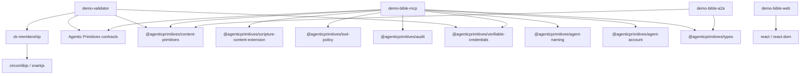
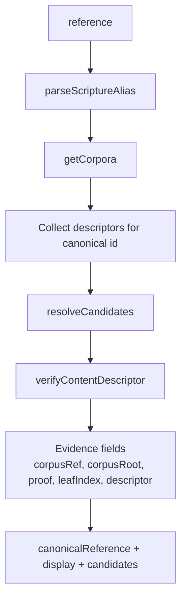
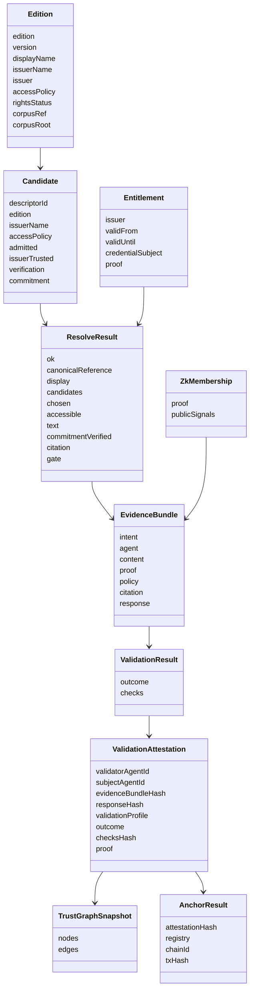
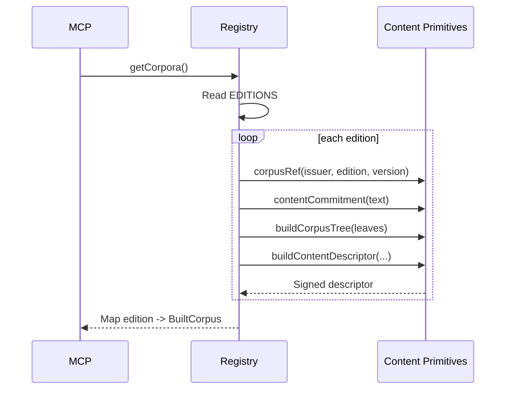
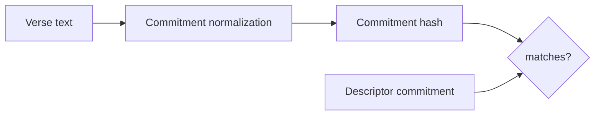
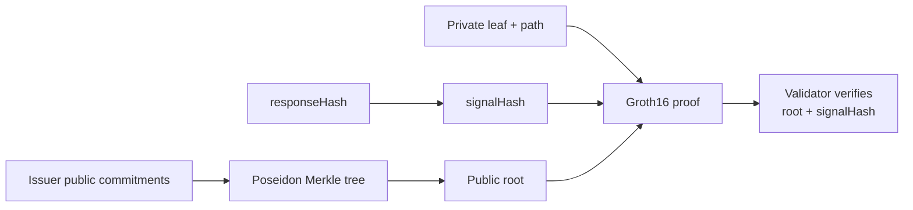
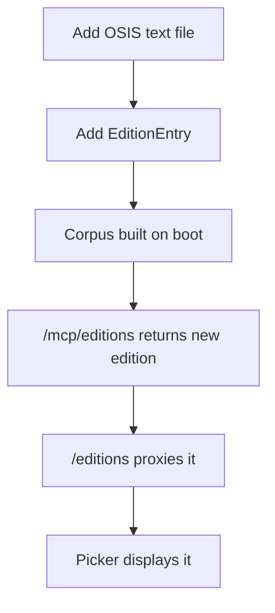

# Technical Architecture

## Purpose

This document maps the architecture to code: workspace packages, endpoints, domain types, verification logic, and extension points.

## Workspace Layout

```text
apps/
  demo-bible-web/   React + Vite UI
  demo-bible-a2a/   Hono Worker orchestration agent
  demo-bible-mcp/   Hono Worker content/tool server
  demo-validator/   Hono Node service for independent validation
packages/
  zk-membership/    Groth16 zk-SNARK membership proof package
  legal-content-extension/  second vertical proving genericity
scripts/
  check-no-licensed-content.ts
docs/
  architecture documentation
```

## Package Dependencies



## API Surface

### Web to A2A

| Method | Path | Purpose |
| --- | --- | --- |
| `GET` | `/a2a/editions` | Load edition registry for the picker. |
| `GET` | `/a2a/books` | Load OSIS book table for the picker. |
| `POST` | `/a2a/resolve` | Resolve a passage and return text/provenance/citation. |
| `POST` | `/a2a/issue-entitlement` | Request a signed entitlement for a gated edition. |
| `POST` | `/a2a/ask` | Ask a topic question and receive an answer with signed citations. |
| `POST` | `/a2a/verify` | Verify a signed citation against the current source descriptor. |
| `GET` | `/a2a/transparency` | Read the in-memory citation transparency log. |
| `POST` | `/a2a/trust/validate` | Assemble an evidence bundle, call the validator, and return attestation + trust graph. |

### A2A

| Method | Path | Purpose |
| --- | --- | --- |
| `GET` | `/health` | Service health. |
| `GET` | `/.well-known/agent-card.json` | A2A discovery metadata and skill declaration. |
| `GET` | `/editions` | Proxy to MCP edition registry. |
| `GET` | `/books` | Proxy to MCP book table. |
| `POST` | `/issue-entitlement` | Proxy signed entitlement issuance to MCP. |
| `POST` | `/resolve` | Orchestrated scripture resolution skill. |
| `POST` | `/ask` | Deterministic topic-answer demo that emits signed citations. |
| `POST` | `/verify` | Verify a citation signature and commitment against MCP. |
| `GET` | `/transparency` | In-memory transparency log of emitted citations. |
| `POST` | `/trust/validate` | Evidence bundle facade to hosted validator. |

### MCP

| Method | Path | Purpose |
| --- | --- | --- |
| `GET` | `/health` | Service health and issuer. |
| `GET` | `/mcp/editions` | Public edition registry. |
| `GET` | `/mcp/books` | OSIS book table. |
| `GET` | `/corpus/:edition` | Ordered public commitments for validator ZK root derivation. |
| `POST` | `/tools/resolve` | Resolve canonical locus and candidate descriptors. |
| `POST` | `/tools/get_passage_text` | Return text when access policy allows it. |
| `POST` | `/tools/issue_entitlement` | Issue signed entitlement for non-public editions. |
| `POST` | `/tools/verify_citation` | Re-check commitment against descriptor. |

### Validator

| Method | Path | Purpose |
| --- | --- | --- |
| `GET` | `/health` | Service health, configured MCP URL, and trusted issuer list. |
| `POST` | `/validate` | Validate an evidence bundle and return `validated`, `gated`, or `rejected`, plus signed attestation, trust graph, and optional anchor. |

### Contracts

| Contract | Purpose |
| --- | --- |
| Agent Naming registry/resolver | Resolves issuer names such as `bsb.agent` to Smart Agent identities. |
| Agent Account | Smart Agent account used for ERC-1271 signature verification. |
| `ContentCorpusRegistry` | Stores issuer-authorized corpus roots and manifest hashes. |
| `ValidationAttestationRegistry` | Optionally stores compact validation attestation anchors. |

## Resolve Implementation



Key code:

- `apps/demo-bible-mcp/src/index.ts` owns the MCP routes.
- `apps/demo-bible-mcp/src/editions/registry.ts` builds corpora, manifests, descriptors, Merkle trees, and inclusion proofs.
- `apps/demo-bible-a2a/src/index.ts` owns orchestration and citation creation.
- `apps/demo-bible-web/src/api.ts` owns browser-side API calls and response shapes.
- `apps/demo-bible-web/src/App.tsx` owns the picker, result card, provenance card, candidate list, and citation details.
- `apps/demo-validator/src/bundle.ts` defines the compact validation envelope.
- `apps/demo-validator/src/validate.ts` re-derives and checks the validation bundle.
- `apps/demo-validator/src/attestation.ts` signs validator outcomes as `ValidationAttestation` credentials.
- `apps/demo-validator/src/trust-graph.ts` builds scoped trust graph edges for the UI.
- `apps/demo-validator/src/anchor.ts` optionally anchors attestation hashes on-chain.
- `apps/demo-validator/src/zk.ts` verifies Groth16 membership proofs in the hosted validator.
- `packages/zk-membership/src/index.ts` builds Poseidon trees and creates Groth16 proofs for local/e2e proving.
- `scripts/validator-e2e.ts` assembles a live evidence bundle with ZK proof, calls the hosted validator, verifies the attestation, graph edge, and optional anchor.

## Core Domain Types



## Corpus Build

At boot, `getCorpora()` lazily builds and caches corpora from `EDITIONS`.



## Verification Algorithm

Descriptor verification:

1. Parse reference into canonical scripture locus.
2. Collect descriptors for the locus across editions.
3. Apply trust profile with `resolveCandidates`.
4. For admitted candidates, verify issuer signature.
5. Verify Merkle inclusion against the corpus root.
6. In on-chain mode, optionally read the expected corpus root from `ContentCorpusRegistry`.

Text verification:

1. Retrieve text only after access policy allows it.
2. Recompute normalized commitment.
3. Compare against the descriptor commitment.
4. Include `commitmentVerified` in the A2A response and citation.

Validator verification:

1. Check the bundle shape.
2. Recompute `canonicalId` from `canonicalEnvelope`.
3. Verify descriptor signature and keccak Merkle inclusion.
4. Check issuer admission against `trustedIssuers`.
5. Verify commitment-to-text and response hash binding.
6. Verify policy and issuer-signed entitlement when required.
7. Verify the responding agent's signed `CitationAssertion`.
8. Verify citation binding to `{canonicalId, descriptorId, commitment, agentRunId, outputId}`.
9. If present, verify Groth16 zk membership against a Poseidon root derived from `GET /corpus/:edition`.
10. Sign a `ValidationAttestation` over the bundle hash, response hash, check hash, profile, and outcome.
11. Build a trust graph snapshot with `TRUSTS_VALIDATOR`, `TRUSTS_PROFILE`, `VALIDATED_OUTPUT`, `CITED_DESCRIPTOR`, and `ISSUED_DESCRIPTOR`.
12. Optionally anchor the attestation hash in `ValidationAttestationRegistry`.



## ZK Membership

The `zk-membership` package proves that the cited commitment is a member of the issuer's corpus without revealing the leaf or its index. It uses a fixed-depth Poseidon Merkle tree and Groth16 proof generated by `snarkjs`.



Public signals are `[root, signalHash]`. The leaf, index, and path stay private. Run `pnpm zk:setup` before generating or verifying proofs.

## Evidence Bundle

The validator expects the compact envelope from `apps/demo-validator/src/bundle.ts`:

| Section | Purpose |
| --- | --- |
| `intent` | What the user/agent intended: reference, edition, run id, output id. |
| `agent` | Responding agent identity and optional name. |
| `content` | Canonical id/envelope, descriptor, issuer, edition, access policy. |
| `proof` | Commitment, corpus root, inclusion proof, leaf index, optional zk membership. |
| `policy` | Trust profile, policy decision, optional entitlement. |
| `citation` | Signed `CitationAssertion`. |
| `response` | Text, response hash, and quoted span bindings. |

## Trust Validation Response

The A2A `/trust/validate` facade returns:

| Field | Meaning |
| --- | --- |
| `outcome` | `validated`, `gated`, or `rejected`. |
| `checks` | Per-check validator results. |
| `attestation` | Signed `ValidationAttestation` credential from `demo-validator.agent`. |
| `graph` | Trust graph snapshot for UI rendering. |
| `anchor` | Optional on-chain attestation anchor result. |
| `validator` | Validator service URL used by A2A. |

The web `TrustGraphCard` renders the outcome, profile, check count, attestation proof, optional Base Sepolia anchor link, and SVG graph.

## Trust Graph Edges

| Edge | Meaning |
| --- | --- |
| `TRUSTS_VALIDATOR` | The consumer/app trusts `demo-validator.agent` for this profile. |
| `TRUSTS_PROFILE` | The validator applied a scoped validation profile. |
| `VALIDATED_OUTPUT` | The validator attested to one A2A run/output. |
| `CITED_DESCRIPTOR` | The A2A agent cited a specific `ContentDescriptor`. |
| `ISSUED_DESCRIPTOR` | The issuer/publisher issued the cited descriptor. |

## Adding a Translation

For a public-domain edition:

1. Add OSIS-keyed text in `apps/demo-bible-mcp/src/data/<edition>.ts`.
2. Add an `EditionEntry` in `apps/demo-bible-mcp/src/editions/registry.ts`.
3. Run `pnpm check:no-licensed-content`.
4. Run `pnpm typecheck`, `pnpm smoke`, and `pnpm validate:e2e`.

No web or A2A code change is needed because editions flow from the MCP registry to the picker.



## Current Implementation Notes

- `demo-licensed` uses synthetic placeholder text, not copyrighted scripture.
- The dev issuer is a fixed EOA; on-chain mode resolves an issuer Smart Agent by Agent Naming and verifies via ERC-1271.
- `issue_entitlement` creates signed credentials and the web path requests them through A2A `/issue-entitlement`.
- `/ask` uses a deterministic topic map rather than an LLM; it still emits signed citations and writes an in-memory transparency log.
- `/trust/validate` assembles a non-ZK evidence bundle inside the Worker and delegates to the hosted validator; `validate:e2e` adds the local Groth16 proof.
- `validate:e2e` demonstrates an honest bundle, a tampered response, signed validator attestation verification, trust graph edge verification, and optional on-chain anchor verification.
- `ValidationAttestationRegistry` anchoring is best-effort and env-gated; validation does not fail if anchoring is unavailable.
- CORS is enabled on the demo services.
- The root package pins `@agenticprimitives/*` packages at alpha ranges.
