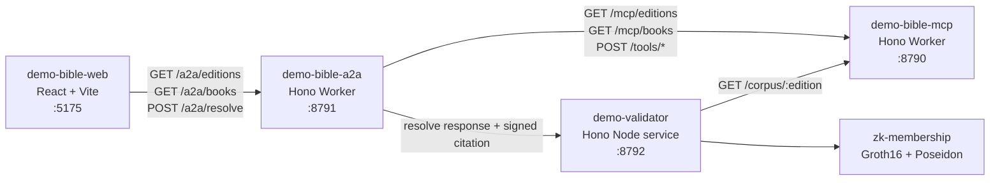

# Architecture Documents

This folder explains the `verifiable-content-demo` architecture and trust model:

- [Branding Approach](./branding-approach.md) - value narrative, differentiation from YouVersion-style products, and stakeholder messaging.
- [Agentic Trust Technical Description](./agentic-trust-technical-description.md) - simple technical explanation of validators, translation agents, and shared response evidence.
- [Information Architecture](./information-architecture.md) - user-facing concepts, labels, content objects, and navigation model.
- [Operational Architecture](./operational-architecture.md) - local services, ports, scripts, runtime dependencies, checks, and observability.
- [System Architecture](./system-architecture.md) - component boundaries, trust boundaries, data flow, and entitlement flow.
- [Technical Architecture](./technical-architecture.md) - implementation details, package layout, APIs, domain types, and extension points.

The demo is a multi-package workspace:

Core principle: verse text stays in the app's off-platform store; verifiability comes from canonical scripture loci, issuer-signed content descriptors, commitments, Merkle inclusion, optional Groth16 zk membership, entitlement policy, signed citations, and independent validator checks.
