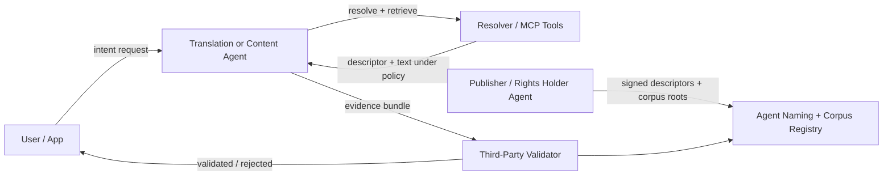
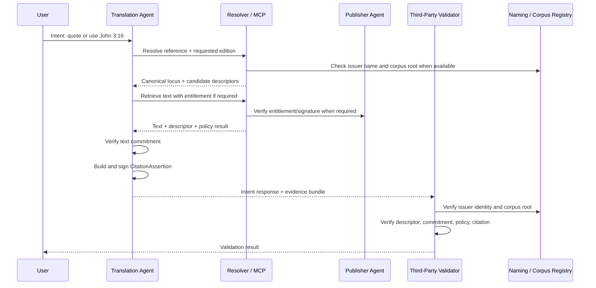
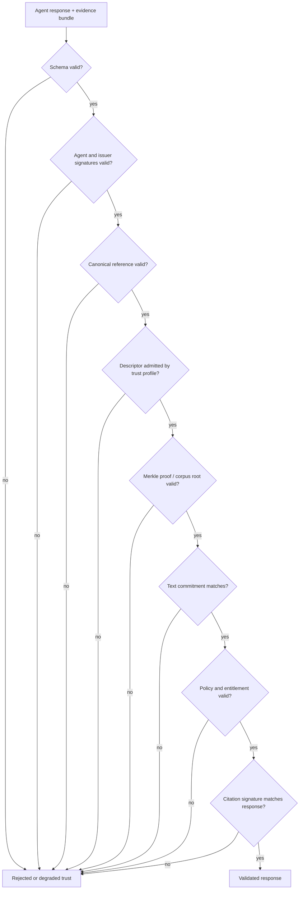

# Agentic Trust Technical Description

## Simple Description

This approach gives agents a shared way to reference, verify, retrieve, cite, and audit content.

Instead of an agent saying:

> "Here is John 3:16 from this translation. Trust me."

the agent returns a verifiable evidence bundle:

> "Here is the canonical reference I resolved, the issuer-signed descriptor I used, the content commitment I verified, the policy that allowed access, and the signed citation record for this response."

The core idea is that content trust is split into separate parts:

- A stable content reference, such as the canonical identity for `John 3:16`.
- A signed `ContentDescriptor`, where an issuer claims a specific rendering exists for that reference.
- A commitment/hash of the actual text, so retrieved text can be checked.
- A policy and entitlement layer, so licensed/private content is not treated as open content.
- A signed `CitationAssertion`, where the responding agent records exactly what it used.
- An audit trail, so the response can be reviewed later.

Scripture is the first vertical, but the pattern works for any content domain where agents need trustworthy references.

## Roles



### Publisher or Rights Holder Agent

The publisher agent owns the authority for a translation or corpus. It signs descriptors, controls retrieval, issues entitlements, and may anchor corpus roots on-chain.

### Translation or Content Agent

The responding agent handles the user's request. It may resolve references, retrieve text, produce summaries, quote content, or generate a translation-oriented response. To establish trust, it must include enough structured evidence for validators to check its work.

### Third-Party Validator

The validator is independent of the responding agent. It does not need to trust the agent's claim. It checks signatures, names, corpus membership, commitments, policies, entitlements, and citation records.

### End User or App

The user sees a simple outcome: verified, partially verified, gated, or rejected. The detailed proof stays machine-readable unless the user wants to inspect provenance.

## Agentic Trust Flow



## What the Third-Party Validator Checks

A validator can validate an agent response if the response includes enough common evidence.

The validator checks:

- The human reference was normalized into the expected canonical reference.
- The selected descriptor matches that canonical reference.
- The descriptor was signed by the claimed issuer.
- The issuer identity resolves through Agent Naming when on-chain trust mode is used.
- The descriptor belongs to the claimed corpus using a Merkle inclusion proof.
- The corpus root matches the anchored root when a content corpus registry is available.
- The returned text matches the descriptor commitment.
- The access policy was followed.
- Any entitlement was signed by the right issuer and applies to the right corpus.
- The responding agent signed the `CitationAssertion`.
- The citation's descriptor, commitment, canonical id, agent run id, and output id match the response.

## Common Bits Every Agent Should Include

For validators to validate intent responses, other agents should include this evidence bundle.

### 1. Agent Identity

The responding agent should identify itself.

Required fields:

| Field | Purpose |
| --- | --- |
| `agentId` | Stable agent identifier, DID, address, or Smart Agent address. |
| `agentName` | Optional human-readable name, preferably resolvable through Agent Naming. |
| `agentSignature` | Signature over the response or signed citation. |
| `agentRunId` | Unique run id for audit and replay analysis. |
| `outputId` | Id of the specific generated response/output. |

### 2. User Intent

The validator needs to know what the agent was trying to do.

Required fields:

| Field | Purpose |
| --- | --- |
| `intentType` | Example: `quote`, `reference`, `summarize`, `translate`, `compare`, `retrieve`. |
| `requestedReference` | Original user reference, such as `John 3:16`. |
| `requestedEdition` | Requested translation or edition, if any. |
| `constraints` | Policy or user constraints, such as public-domain only, licensed allowed, or ministry sensitivity profile. |

### 3. Canonical Reference

The response must include the normalized reference.

Required fields:

| Field | Purpose |
| --- | --- |
| `canonicalId` | Deterministic `CanonicalLocusId`. |
| `canonicalEnvelope` | Structured, schema-validated reference object used to produce the id. |
| `scheme` | Domain scheme, such as `scripture.verse`. |
| `normalizationVersion` | Version of the domain normalization model. |
| `displayReference` | Human-readable reference shown to the user. |

### 4. Content Descriptor

The descriptor is the issuer's signed claim about a rendering.

Required fields:

| Field | Purpose |
| --- | --- |
| `descriptorId` | Stable descriptor id. |
| `descriptor` | Full signed `ContentDescriptor` or a resolvable pointer to it. |
| `issuer` | Issuer address, DID, or Smart Agent identity. |
| `issuerName` | Optional Agent Naming name, such as `bsb.agent`. |
| `edition` | Translation/corpus edition. |
| `rightsStatus` | Public-domain, licensed, private, etc. |
| `accessPolicy` | Public, licensed, private, or custom policy. |
| `retrievalPointer` | Pointer to the off-platform artifact/text. |

### 5. Commitment and Proof

The validator needs to prove the text came from the descriptor's committed rendering.

Required fields:

| Field | Purpose |
| --- | --- |
| `commitment` | Hash/commitment from the descriptor. |
| `commitmentAlgorithm` | Algorithm used to compute the commitment. |
| `normalizationSpec` | Text normalization rules used before hashing. |
| `commitmentVerified` | Whether the responding agent verified the returned text. |
| `inclusionProof` | Merkle proof showing descriptor/artifact membership in the corpus. |
| `corpusRef` | Stable corpus reference. |
| `corpusRoot` | Merkle root used for validation. |
| `anchoredCorpusRoot` | Optional on-chain root read by validator. |

### 6. Policy and Entitlement

If content is not public, the validator must see why access was allowed.

Required fields:

| Field | Purpose |
| --- | --- |
| `policyProfile` | Trust profile used by the agent, such as public-domain demo or strict rights-holder. |
| `policyDecision` | Allow, deny, gated, or partial. |
| `entitlement` | Signed entitlement credential, if required. |
| `entitlementIssuer` | Issuer that signed the entitlement. |
| `entitlementVerification` | Structural and signature validation result. |
| `accessScope` | Corpus, edition, subject, expiry, and access level. |

### 7. Citation Assertion

The citation is the agent's signed record of content use.

Required fields:

| Field | Purpose |
| --- | --- |
| `citation` | Signed `CitationAssertion`. |
| `citationKind` | Quote, reference, summary, translation, comparison, etc. |
| `contentIssuer` | Issuer of the underlying descriptor/content. |
| `agentIssuer` | Agent that signed the citation. |
| `validFrom` | Time the citation was created. |
| `proof` | Signature proof over the citation. |

### 8. Response Binding

The evidence must be bound to the actual response, not just attached beside it.

Required fields:

| Field | Purpose |
| --- | --- |
| `responseHash` | Hash of the user-visible response or quoted span. |
| `quotedSpans` | Exact spans quoted, if the response quotes text. |
| `sourceMap` | Mapping from response spans to descriptor/canonical ids. |
| `redactions` | Any intentionally withheld or gated content. |
| `auditEventIds` | Optional links to audit records. |

## Minimal Validation Envelope

A compact interoperable response could look like this:

```json
{
  "intent": {
    "intentType": "quote",
    "requestedReference": "John 3:16",
    "requestedEdition": "bsb",
    "agentRunId": "run_123",
    "outputId": "answer_1"
  },
  "agent": {
    "agentId": "eip155:31337:0x...",
    "agentName": "scripture-resolver.agent"
  },
  "content": {
    "canonicalId": "0x...",
    "canonicalEnvelope": {},
    "scheme": "scripture.verse",
    "descriptorId": "desc_bsb_...",
    "descriptor": {},
    "issuer": "0x...",
    "issuerName": "bsb.agent",
    "edition": "bsb",
    "accessPolicy": "public"
  },
  "proof": {
    "commitment": {
      "value": "0x...",
      "algorithm": "sha-256",
      "normalization": "..."
    },
    "commitmentVerified": true,
    "corpusRef": "0x...",
    "corpusRoot": "0x...",
    "inclusionProof": ["0x..."]
  },
  "policy": {
    "policyProfile": "public-domain-demo",
    "policyDecision": "allow",
    "entitlement": null
  },
  "citation": {
    "type": ["VerifiableCredential", "CitationAssertion"],
    "credentialSubject": {},
    "proof": {}
  },
  "response": {
    "text": "For God so loved the world...",
    "responseHash": "0x...",
    "quotedSpans": [
      {
        "start": 0,
        "end": 29,
        "descriptorId": "desc_bsb_..."
      }
    ]
  }
}
```

## Validation Outcomes



## How Other Translation Agents Use This

Other agents can bring their own translation workflows, models, retrieval systems, or publisher integrations. They do not need to copy this app. They need to emit the common trust artifacts.

At minimum, a compatible translation agent should:

1. Resolve user references into canonical ids using the relevant domain extension.
2. Use issuer-signed descriptors for the content it references.
3. Retrieve text through policy-aware paths.
4. Verify the retrieved text against descriptor commitments.
5. Respect entitlements for licensed/private content.
6. Sign a citation assertion for the exact response it produced.
7. Return a validation envelope that third-party validators can check.

If the agent produces a new translation, paraphrase, or generated rendering, it should also include:

- The source descriptors it used.
- The transformation intent, such as translation, simplification, summary, or comparison.
- The generated output hash.
- The model or agent identity that produced it.
- A signed assertion distinguishing source quotation from generated rendering.
- Any reviewer, publisher, or validator attestations attached to the generated output.

## Why This Matters

This creates portable agentic trust. A user, platform, publisher, or ministry organization does not have to trust a single app's internal database. They can ask an independent validator to check the evidence.

The validator can answer:

- Was this the right canonical reference?
- Who issued the content claim?
- Did the issuer's name resolve to the expected agent identity?
- Was the descriptor part of the claimed corpus?
- Did the text match the commitment?
- Was access allowed under policy?
- Did the responding agent sign the citation?
- Does the citation match the actual response?

That is the difference between content access and agentic trust.
