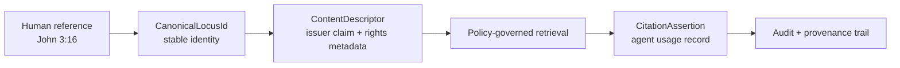
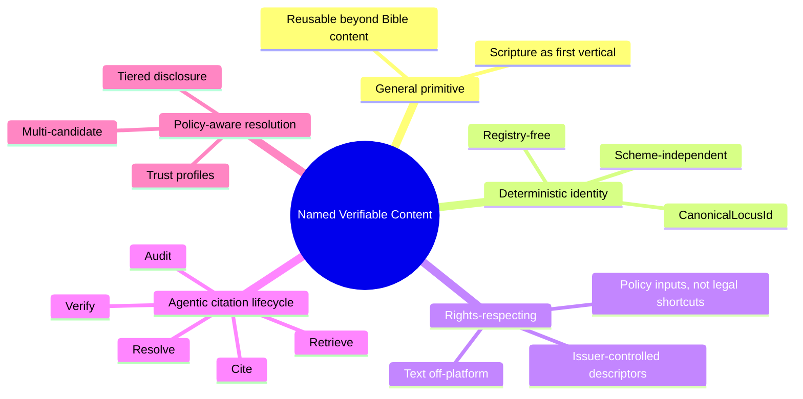
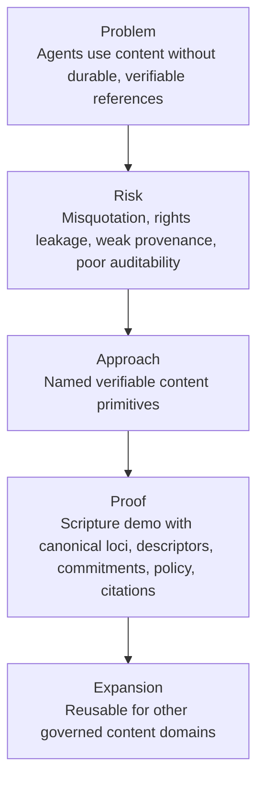

# Branding Approach

## Positioning Statement

We are building agent-native named content provenance infrastructure: deterministic content references, issuer-controlled claims, policy-governed access, and auditable citation for the agentic era.

This is not a Bible verse database, another content-addressable store, or a translation-branded naming layer. Scripture is the first high-value vertical because it has stable references, meaningful rights complexity, and high trust requirements. The underlying primitive generalizes to any content domain where agents must name, verify, retrieve, cite, and audit governed content.

## Brandable Core Message

Agents need more than content access. They need trustworthy references.

Named Verifiable Content Primitives give agents a reusable way to resolve a human reference into a stable canonical identity, verify issuer claims, retrieve content only under policy, and produce citations with provenance. Rights holders keep control of their text, descriptors, and retrieval paths. Agent platforms gain a shared trust layer for content use.

Short version:

> We are not putting Bibles on the blockchain. We are giving agents and organizations a trustworthy way to name, verify, cite, and audit references to content, starting with Scripture.

## The Category

This should be branded as infrastructure, not an end-user Bible product.

Potential category language:

- Named content provenance
- Agent-native content references
- Verifiable content primitives
- Policy-governed citation infrastructure
- Trust layer for agentic content use

Recommended category phrase:

> Agent-native named content provenance

## Core Value

The value is clean separation:

| Layer | Purpose | Controlled By |
| --- | --- | --- |
| Stable reference identity | Deterministic canonical IDs for references. | Domain extension. |
| Issuer claims | Signed descriptors, rights metadata, commitments. | Rights holder or issuer. |
| Actual content | Off-chain rendering text or artifacts. | Rights holder or content host. |
| Agent usage | Citation assertions and audit records. | Agent/runtime. |
| Policy | Access and trust profile decisions. | Deploying organization. |

## Differentiation from YouVersion

YouVersion is a high-scale consumer Bible reading, discovery, devotional, and engagement platform. This project is a trust and provenance layer for agentic content use.

| Dimension | YouVersion-Style Approach | Named Verifiable Content Primitives |
| --- | --- | --- |
| Product shape | End-user Bible app and content experience. | Reusable infrastructure primitive. |
| Primary user | Readers, churches, devotional communities. | Agents, platforms, publishers, ministries, institutions. |
| Content model | App-managed translation access and presentation. | Issuer-controlled descriptors and retrieval paths. |
| Reference model | Human-friendly Bible references and app metadata. | Deterministic canonical locus IDs from validated envelopes. |
| Trust model | Platform-mediated content experience. | Verifiable issuer claims, commitments, policy, and audit. |
| Rights posture | Licensed content relationships inside a product. | Rights holders keep text behind their own systems and publish verifiable claims. |
| Agent readiness | Useful as a source or app, but not a general citation primitive. | Built for resolution, verification, policy, citation, and audit by agents. |
| Generalization | Bible-specific consumer ecosystem. | General primitive for scripture, hymns, liturgy, legal, medical, training, and other governed content. |

The message is not "better Bible app." The message is "different layer."

YouVersion helps people read and engage Scripture. Named Verifiable Content Primitives help agents and organizations prove what content reference was used, who claimed it, whether access was allowed, and how it was cited.

## Differentiation from Other Existing Solutions

### Not a Content-Addressable Store

Content-addressable systems identify bytes or artifacts. This system names stable references and binds them to issuer claims about specific renderings. A verse reference, legal clause, hymn stanza, or medical guideline can resolve to candidates without making the hash itself the user-facing name.

### Not an On-Chain Text Experiment

The platform does not put scripture text on-chain. Text remains off-platform. Commitments, descriptors, and provenance make content use verifiable without publishing controlled text or collapsing rights boundaries.

### Not a Translation-Branded Namespace

Canonical identity is independent of translation brand. The same passage reference can resolve across editions because the canonical locus is separate from the rendering and rights metadata.

### Not a Vertical Silo

Scripture is a proving ground, not the boundary of the architecture. The same primitive can serve other domains that need stable references, governed retrieval, and auditable agent use.

### Not Just Hash Matching

The lifecycle includes resolution, trust profile filtering, descriptor verification, entitlement-aware retrieval, commitment verification, citation assertion, and audit. The value is the full chain, not a single checksum.

## Five Pillars

## Stakeholder Value

### Rights Holders and Publishers

They can publish signed descriptors and commitments while keeping text behind existing licensed APIs, storage, contracts, and business processes. They do not have to cede namespace ownership or put content into a third-party public database.

### Agent Developers and Platforms

They get reliable resolution, verifiable claims, policy filtering, and auditable citations without rebuilding normalization, rights metadata, trust profiles, or provenance systems for every domain.

### Faith and Ministry Organizations

They get stronger provenance for scripture references, sensitive introductions, ministry resources, MOUs, training materials, and other high-trust content. Policy profiles can support compartmentalization, audit minimization, and do-no-harm workflows.

### Broader Agentic Ecosystem

The primitive composes with identity, delegation, policy, custody, MCP runtime, intent layers, and agent naming systems. It advances governed agentic systems by making content references verifiable and reusable.

## Message Architecture

### One-Line Message

Trustworthy content references for agents.

### One-Sentence Message

Named Verifiable Content Primitives let agents resolve, verify, retrieve under policy, cite with provenance, and audit references to governed content.

### One-Paragraph Message

We provide agent-native named content provenance infrastructure. A human reference resolves to a deterministic canonical identity, issuer-signed descriptors state claims and rights metadata, content remains off-platform under rights-holder control, and agents produce citation records with provenance and audit. Scripture is the first serious vertical, but the primitive generalizes to any governed content domain.

### Slide-Friendly Message

- Deterministic canonical references, not platform-owned names.
- Issuer-signed descriptors, not unverifiable metadata.
- Rights-holder controlled content, not on-chain text.
- Policy-governed retrieval, not open-ended scraping.
- Agent-signed citations and audit, not opaque AI outputs.

## Recommended Brand Narrative

Narrative:

1. Agents increasingly assemble answers, recommendations, documents, and actions from referenced content.
2. Existing systems give them access to content, but not a reusable way to prove what was referenced, who claimed it, whether retrieval was allowed, and how it was cited.
3. Named Verifiable Content Primitives fill that gap with deterministic identity, issuer-signed descriptors, commitments, policy, citation assertions, and audit.
4. Scripture proves the pattern in a domain where references are stable, rights are complex, and trust matters.
5. The same pattern extends to other high-trust content domains.

## Honest Scope

This is not a complete Bible delivery system. It is the trust, naming, policy, and provenance layer that can make Bible systems and many other content systems agent-ready.

The MVP should avoid over-claiming:

- It does not replace consumer Bible apps.
- It does not grant legal rights by itself.
- It does not require licensed text to enter this repo.
- It does not need full ZK or heavy VC complexity to prove the core value.
- It does depend on disciplined core/extension boundaries and rights-holder adoption for licensed depth.

## Best Positioning

The strongest defensible position:

> Agent-native named content provenance infrastructure: deterministic identity, issuer-controlled claims, policy-governed access, and auditable citation, with Scripture as the first serious vertical.

The clearest differentiation:

> We are not building another Bible app. We are building the trust layer agents need to reference governed content responsibly.
