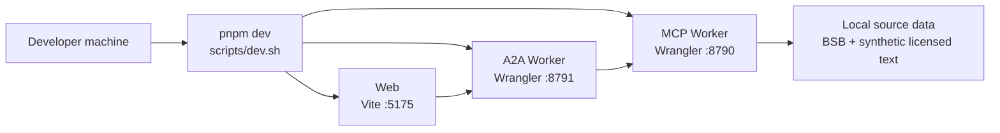
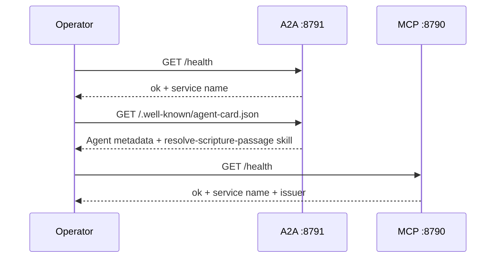
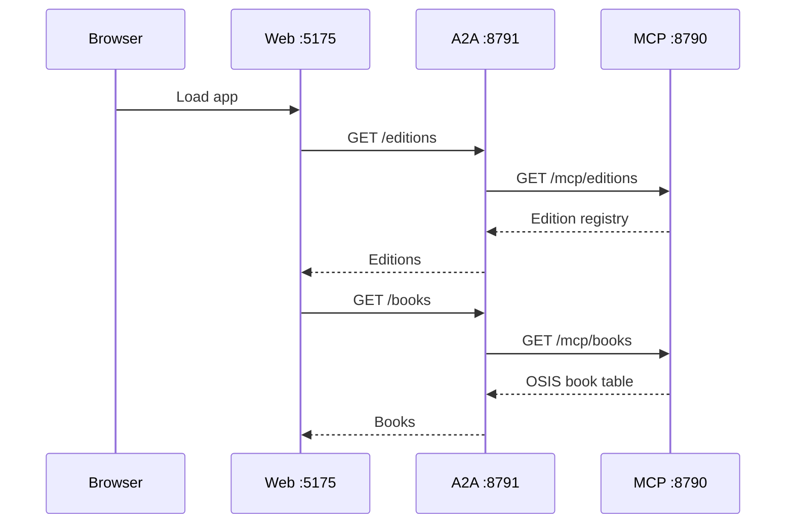
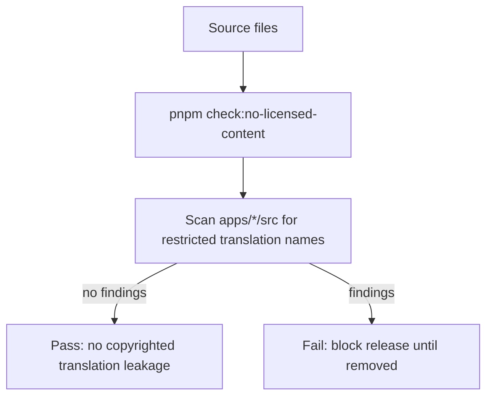

# Operational Architecture

## Purpose

The demo runs as three local services in a pnpm workspace. The web app serves the UI, the A2A worker provides the agent-facing orchestration surface, and the MCP worker owns content resolution, text retrieval, policy gates, verification, and audit events.

## Runtime Topology

## Services

| Service | Package | Port | Responsibility |
| --- | --- | --- | --- |
| Web | `@verifiable-content-demo/bible-web` | `5175` | React UI, picker, result display, provenance card. |
| A2A | `@verifiable-content-demo/bible-a2a` | `8791` | Agent card, editions/books proxy, resolve orchestration, citation building. |
| MCP | `@verifiable-content-demo/bible-mcp` | `8790` | Edition registry, scripture tools, corpus build, policy checks, entitlement verification, audit. |

## Commands

| Command | Use |
| --- | --- |
| `pnpm dev` | Run MCP, A2A, and web together. |
| `pnpm dev:mcp` | Run only the MCP worker. |
| `pnpm dev:a2a` | Run only the A2A worker. |
| `pnpm dev:web` | Run only the React/Vite app. |
| `pnpm build` | Build all workspace packages. |
| `pnpm typecheck` | Typecheck all workspace packages. |
| `pnpm smoke` | Run the in-process proof flow without servers. |
| `pnpm check:no-licensed-content` | Ensure copyrighted translation text is not embedded. |

## Health and Discovery

## Operational Flow

## Audit and Policy

The MCP worker writes structured audit events through `@agenticprimitives/audit` using a console sink. Audited actions include:

- `content.resolve`
- `content.text.access`
- `content.entitlement.verify`
- `content.entitlement.issue`
- `content.citation.verify`

Tool access is classified with `@agenticprimitives/tool-policy`. Current demo tools are service-only, service-HMAC classified, and low risk. The policy gate is evaluated before protected tool execution.

## Content Safety Controls

Operational rule: the repo ships public-domain text only. The `demo-licensed` edition is synthetic placeholder text used to exercise the entitlement gate.

## Environment and Configuration

| Setting | Owner | Default |
| --- | --- | --- |
| `MCP_URL` | A2A worker | `http://127.0.0.1:8790` |
| `A2A_PUBLIC_ORIGIN` | A2A worker | Request origin |
| `A2A_BASE` | Web app | `/a2a` |

The A2A and MCP workers run through Wrangler. Local persistence is configured in each app's `wrangler.toml` and dev script.

## Failure Modes

| Failure | User Effect | Operational Check |
| --- | --- | --- |
| MCP down | Editions, books, or resolve fail through A2A. | `GET :8790/health` |
| A2A down | Web app cannot load data or resolve passages. | `GET :8791/health` |
| Unknown edition | Text retrieval returns `404`. | Check `EDITIONS` registry. |
| Bad reference | Resolve returns `400`. | Check scripture alias parsing. |
| Entitlement denied | User sees gated text state. | Inspect MCP audit logs. |
| Commitment mismatch | Provenance shows failed verification. | Rebuild corpus and verify source text. |
