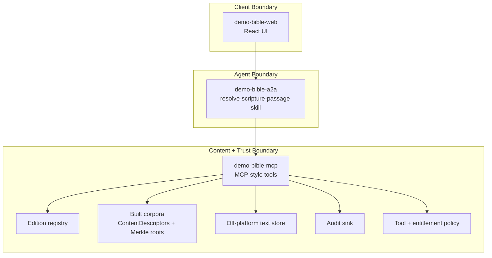
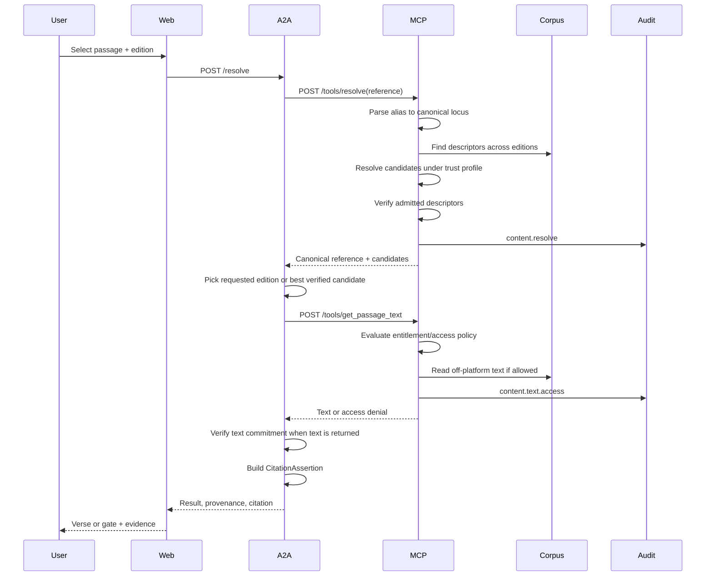
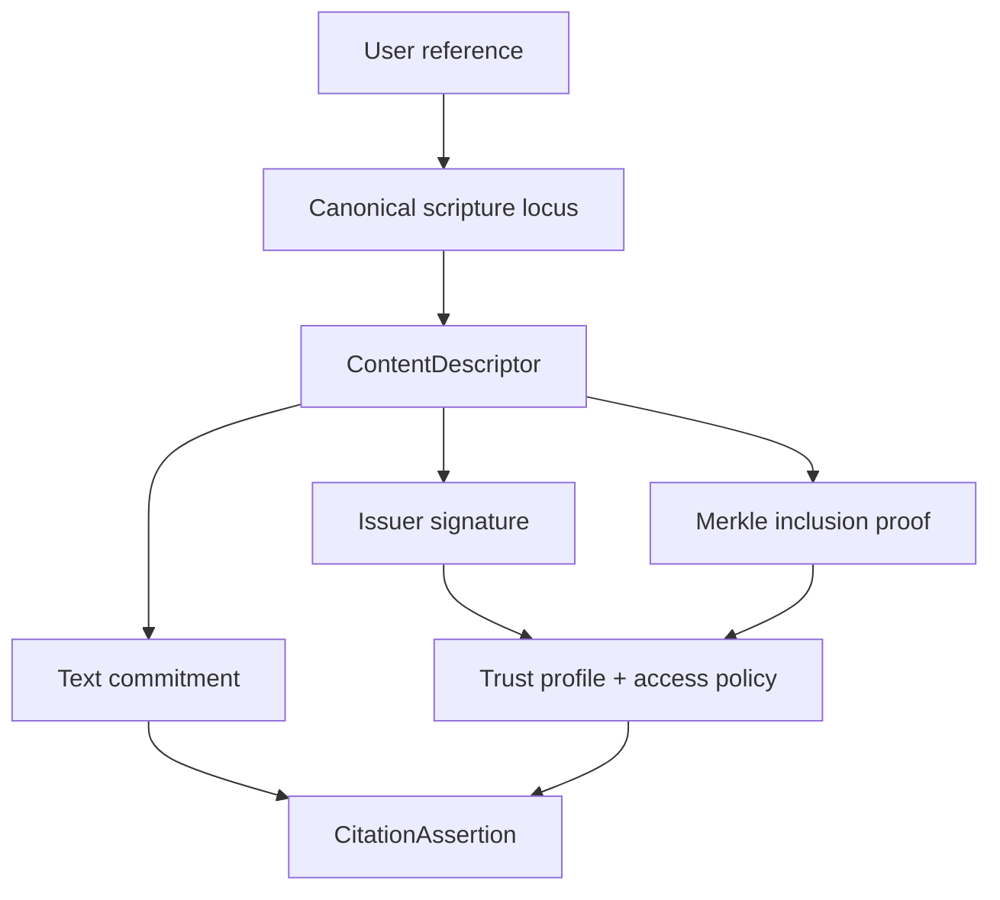
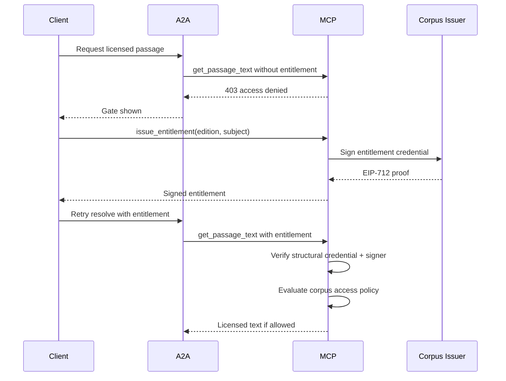
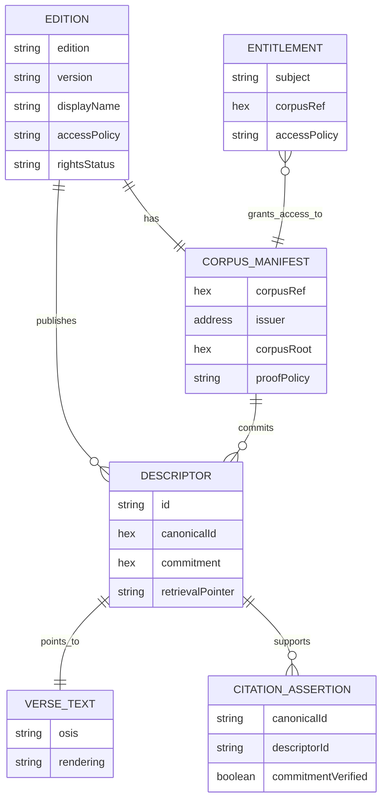

# System Architecture

## Purpose

The system demonstrates verifiable scripture lookup using three bounded components: a user interface, an A2A orchestration agent, and an MCP content/tool server. Trust is attached to descriptors, commitments, issuer signatures, and policy decisions rather than to the UI.

## Component View

## Responsibilities

| Component | Responsibility | Does Not Own |
| --- | --- | --- |
| Web | User interaction, result rendering, provenance display. | Descriptor verification or corpus building. |
| A2A | Orchestrates resolve, text retrieval, verification, and citation building. | Raw corpus data or trust policy configuration. |
| MCP | Owns tools, corpora, policy gates, entitlement checks, descriptor verification, and audit. | UI decisions. |
| Agentic Primitives packages | Canonicalization, descriptor building, commitments, verification, policy, audit primitives. | Demo-specific corpus content. |

## Main Lookup Flow

## Trust Flow

Verification has two layers:

- Descriptor verification checks issuer signature and Merkle inclusion.
- Text verification checks that retrieved text matches the descriptor's commitment.

## Entitlement Flow

The MCP worker includes `/tools/issue_entitlement` for issuer-signed entitlement credentials. The current web UI builds a local demo entitlement shape, while the stricter MCP text endpoint expects signed entitlements for non-public editions.

## Data Ownership

## Trust Boundaries

| Boundary | Risk | Control |
| --- | --- | --- |
| Browser to A2A | User input and display-only trust. | A2A re-orchestrates and does not trust UI verification. |
| A2A to MCP | Tool invocation and content access. | MCP policy gate and entitlement checks. |
| MCP to source text | Text integrity and rights leakage. | Commitments, public-domain scan, synthetic licensed data. |
| Descriptor to issuer | False provenance. | Signature verification against trusted issuer profile. |
| Descriptor to corpus | Descriptor not in corpus. | Merkle inclusion proof. |
