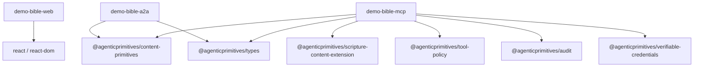
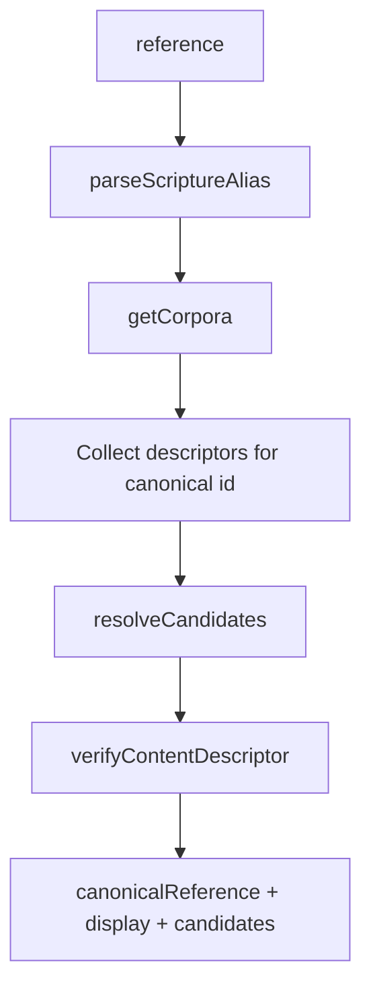
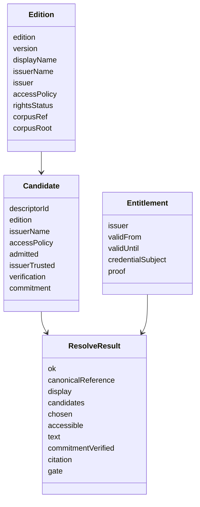
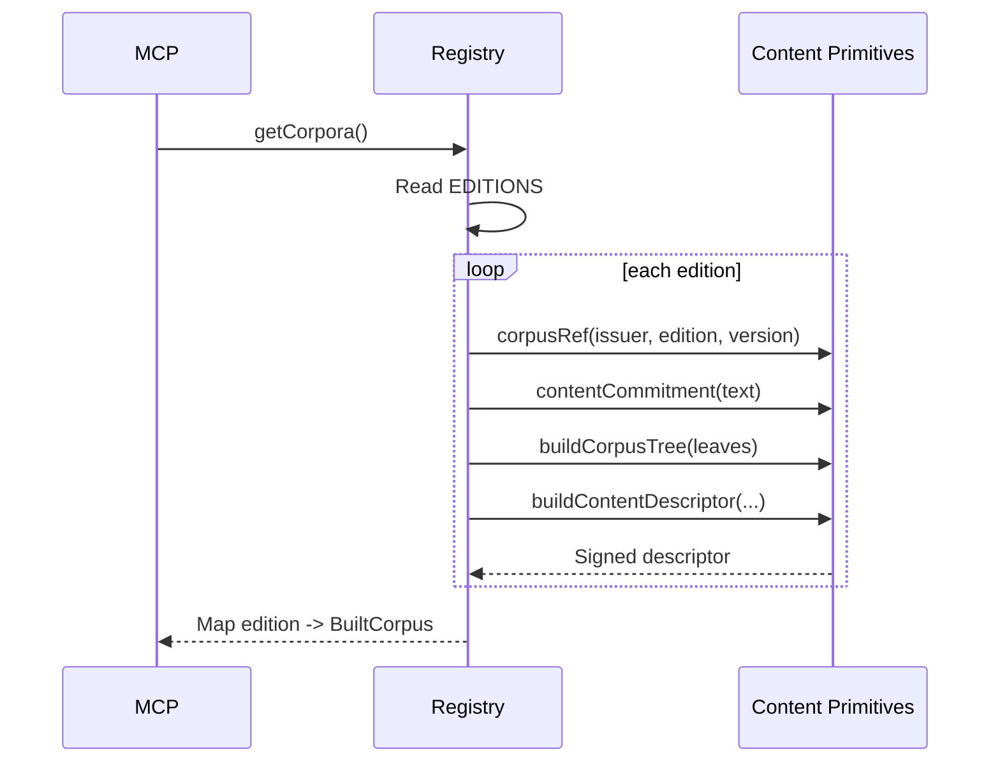
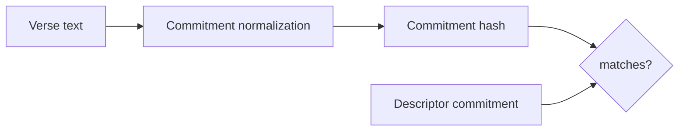
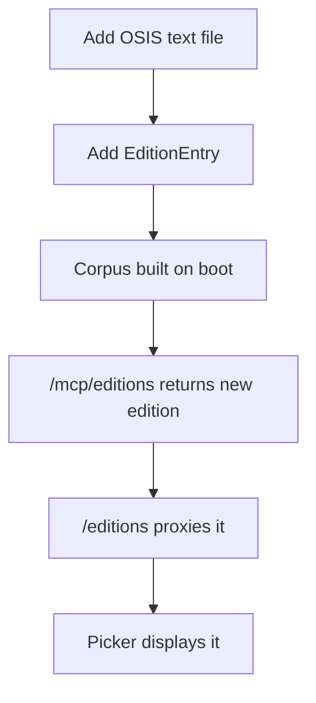

# Technical Architecture

## Purpose

This document maps the architecture to code: workspace packages, endpoints, domain types, verification logic, and extension points.

## Workspace Layout

```text
apps/
  demo-bible-web/   React + Vite UI
  demo-bible-a2a/   Hono Worker orchestration agent
  demo-bible-mcp/   Hono Worker content/tool server
scripts/
  check-no-licensed-content.ts
documents/
  architecture documentation
```

## Package Dependencies



## API Surface

### Web to A2A

| Method | Path | Purpose |
| --- | --- | --- |
| `GET` | `/a2a/editions` | Load edition registry for the picker. |
| `GET` | `/a2a/books` | Load OSIS book table for the picker. |
| `POST` | `/a2a/resolve` | Resolve a passage and return text/provenance/citation. |

### A2A

| Method | Path | Purpose |
| --- | --- | --- |
| `GET` | `/health` | Service health. |
| `GET` | `/.well-known/agent-card.json` | A2A discovery metadata and skill declaration. |
| `GET` | `/editions` | Proxy to MCP edition registry. |
| `GET` | `/books` | Proxy to MCP book table. |
| `POST` | `/resolve` | Orchestrated scripture resolution skill. |

### MCP

| Method | Path | Purpose |
| --- | --- | --- |
| `GET` | `/health` | Service health and issuer. |
| `GET` | `/mcp/editions` | Public edition registry. |
| `GET` | `/mcp/books` | OSIS book table. |
| `POST` | `/tools/resolve` | Resolve canonical locus and candidate descriptors. |
| `POST` | `/tools/get_passage_text` | Return text when access policy allows it. |
| `POST` | `/tools/issue_entitlement` | Issue signed entitlement for non-public editions. |
| `POST` | `/tools/verify_citation` | Re-check commitment against descriptor. |

## Resolve Implementation



Key code:

- `apps/demo-bible-mcp/src/index.ts` owns the MCP routes.
- `apps/demo-bible-mcp/src/editions/registry.ts` builds corpora, manifests, descriptors, Merkle trees, and inclusion proofs.
- `apps/demo-bible-a2a/src/index.ts` owns orchestration and citation creation.
- `apps/demo-bible-web/src/api.ts` owns browser-side API calls and response shapes.
- `apps/demo-bible-web/src/App.tsx` owns the picker, result card, provenance card, candidate list, and citation details.

## Core Domain Types



## Corpus Build

At boot, `getCorpora()` lazily builds and caches corpora from `EDITIONS`.



## Verification Algorithm

Descriptor verification:

1. Parse reference into canonical scripture locus.
2. Collect descriptors for the locus across editions.
3. Apply trust profile with `resolveCandidates`.
4. For admitted candidates, verify issuer signature.
5. Verify Merkle inclusion against the corpus root.

Text verification:

1. Retrieve text only after access policy allows it.
2. Recompute normalized commitment.
3. Compare against the descriptor commitment.
4. Include `commitmentVerified` in the A2A response and citation.



## Adding a Translation

For a public-domain edition:

1. Add OSIS-keyed text in `apps/demo-bible-mcp/src/data/<edition>.ts`.
2. Add an `EditionEntry` in `apps/demo-bible-mcp/src/editions/registry.ts`.
3. Run `pnpm check:no-licensed-content`.
4. Run `pnpm typecheck` and `pnpm smoke`.

No web or A2A code change is needed because editions flow from the MCP registry to the picker.



## Current Implementation Notes

- `demo-licensed` uses synthetic placeholder text, not copyrighted scripture.
- The dev issuer is a fixed EOA in `registry.ts`; production would use a real issuer Smart Agent and ERC-1271 verification.
- `issue_entitlement` creates signed credentials, while the current web helper creates a local demo entitlement shape. Aligning the UI to call `issue_entitlement` would complete the signed licensed flow end to end.
- CORS is enabled on both Hono workers for the demo.
- The root package pins `@agenticprimitives/*` packages at alpha ranges.
